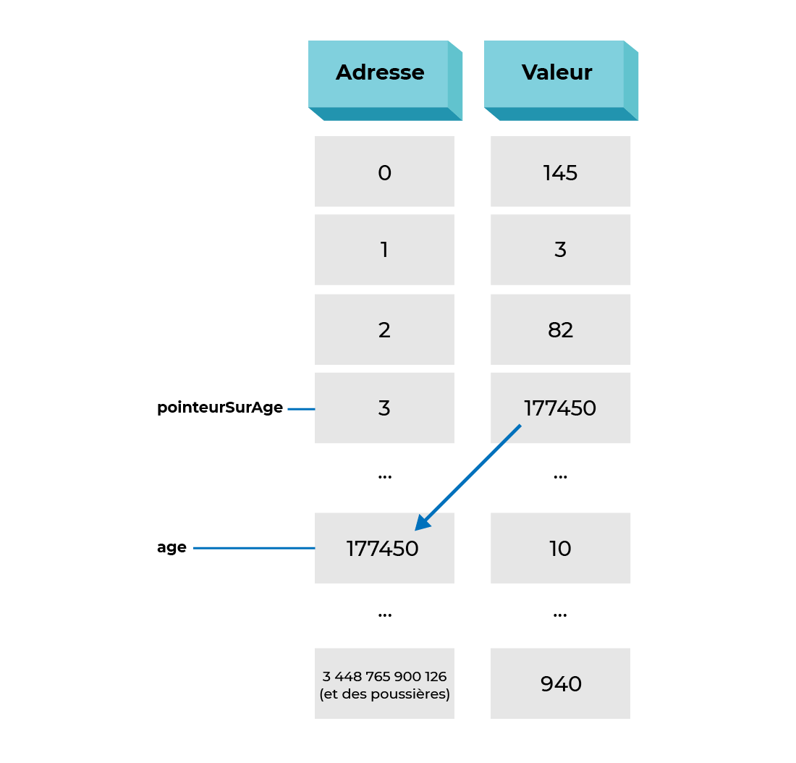

# Langage C - Avancé

## Ressources

https://cheatsheets.zip/c

##

# Les Tableaux

Les tableaux sont une structure de données qui permet de stocker une collection d’éléments de même type.

## Usage

Pour déclarer et utiliser les valeurs d'un tableau, on utilise la syntaxe suivante:

```c
int t[5]; // Tableau de 5 entiers

t[0] = 1; // On affecte à la première valeur du tableau

t[1] = t[0];
```

On peut également initialiser un tableau lors de sa déclaration, et dans ce cas il n'est pas nécessaire de préciser la taille du tableau.

```c
int t[] = {1, 2, 3, 4, 5}; // Tableau de 5 entiers
```

> Les index des tableaux commencent à 0. Le dernier index est donc `taille - 1`.

::: info

La taille du tableau est déterminée au moment de la compilation, et ne peut pas être modifiée par la suite.

:::

## Dans les fonctions

Lorsque l'on passe un tableau en paramètre, on indique `int[]` comme type.

**Attention**: les fonctions ne peuvent pas connaitre la taille d'un tableau, il faut donc passer en plus un entier indiquant la taille du tableau en paramètre.

```c
void fonction(int t[], int taille) {}
```

#### Exemple avancé

```c
#include <math.h>
#include <stdio.h>
#include <stdlib.h>

void printTableau(int t[], int taille)
{
    for (int i = 0; i < taille; i++)
    {
        printf("t[%d] = %d\n", i, t[i]);
    }
    printf("\n");
}

int main(void)
{
    int t1[5] = {1, 2, 3, 4, 5}; // explicitement taille de 5
    int t2[] = {10, 11};         // implicitement taille de 2

    printf("t1[0]: %d\n", t1[0]); // 1: on compte à  partir de 0
    printf("t1[4]: %d\n", t1[4]); // 5: pour une taille de 5, le dernier est donc 4

    t1[3] = 6;
    printf("t1[3]: %d\n", t1[3]); //   t1[3]: 6

    printTableau(t1, 5);
}
```

### Multidimensionnels

Les tableaux multidimensionnels sont des tableaux de tableaux. Ils peuvent etre de 2, 3, 4, ... dimensions.

Un tableau de deux dimensions est communément appelé une **matrice**.

```c
int t1[2][3] = {{1, 2, 3}, {4, 5, 6}};  // 2 dimensions
t1[0][0] = 1;
t1[0][1] = 2;
t1[0][2] = 3;
t1[1][0] = 4;
t1[1][1] = 5;
t1[1][2] = 6;

int t2[2][3][4];                        // 3 dimensions
```

| t1  | 0   | 1   | 2   |
| --- | --- | --- | --- |
| 0   | 1   | 2   | 3   |
| 1   | 4   | 5   | 6   |

On peut parcourir un tableau multidimensionnel avec des boucles imbriquées.

```c
for (int i = 0; i < 2; i++) {
    for (int j = 0; j < 3; j++) {
        printf("t1[%d][%d] = %d\n", i, j, t1[i][j]);
    }
}
```

## Chaines de caractères

Les chaines de caractère ne sont pas un type primitif en C, mais sont utilisables grâce à des tableaux de caractères (`char[]`).

```c
char c1[] = "Bonjour"; // Taille implicite
char c2[255] = "Au revoir"; // Taille explicite

c1[0] = 'Z'; // On peut modifier les caractères d'une chaine de caractères
```

On peut afficher une chaine de caractères avec la fonction `printf` en utilisant le charactère special `%s`.

Pour récupérer une chaine de caractère, il sera préferable d'utiliser la fonction `fgets` plutot que `scanf` (scanf ne lit pas les espaces).

```c
char c1[255] = "Inconnu";
printf("Entrez votre nom: ");
fgets(c1, 255, stdin);
printf("Bonjour %s\n", c1);
```

::: warning

Attention à ne pas confondre les simple `'` et les doubles `"`.

- `'a'` est un caractère
- `"a"` est une chaine de caractères

:::

On ne peut pas réassigner entièrement une chaine de caractères après l'avoir déclarée, on ne peut que modifier ses caractères un par un.

```c
char c1[] = "Bonjour";
c1 = "Au revoir"; // Pas possible, erreur de compilation
c1[0] = 'Z'; // Ok
```

### Fin de chaine

Les chaines de caractères sont terminées par un caractère nul `\0`, qui indique la fin de la chaine même si le tableau contient d'autres caractères après.

- Avec l'exemple precedent, `c1` est de taille 7 (Bonjour + `\0`).
- `c2` quand a lui est de taille 255 mais `c[9] = '\0'`

### Fonctions utilitaires

#### strlen

La fonction `strlen` permet de connaitre la longueur d'une chaine de caractères.

```c
printf("La longueur de c1 est %d\n", strlen(c1));
```

#### strcmp

La fonction `strcmp` permet de comparer deux chaines de caractères. Elle renvoie 0 si les deux chaines sont égales, -1 si la première chaine est plus petite que la deuxième et 1 si la première chaine est plus grande que la deuxième.

```c
printf("c1 et c2 sont %s\n", strcmp(c1, c2) == 0 ? "égales" : "différentes");
```

### Exemple avancé

```c
#include <stdio.h>
#include <string.h>

void inverse(char str[], int len)
{
    for (int i = 0; i < len / 2; i++)
    {
        char tmp = str[i];
        str[i] = str[len - i - 1];
        str[len - i - 1] = tmp;
    }
}

int main(void)
{
    char c1[] = "Bonjour";      // Taille implicite
    char c2[255] = "Au revoir"; // Taille explicite

    printf("c1 = %s\n", c1);

    if (strcmp(c1, c2) == 0)
    {
        printf("Pareil\n");
    }
    else
    {
        printf("Pas pareil\n");
    }

    printf("c1[0] = %c\n", c1[0]);
    printf("c1[6] = %c\n", c1[6]);
    printf("c2[0] = %c\n", c2[0]);

    c1[0] = 'Z';
    printf("c1 = %s\n", c1);
    printf("c1[0] = %c\n", c1[0]);

    inverse(c2, strlen(c2));
    printf("c2 = %s\n", c2);

    return 0;
}
```

##

# Les Structures

Il arrive souvent que l'on doive stocker des données pour lesquelles une seule variable ne suffit pas. Plutot que de créér plusieurs variables, on peut va préferer creer des structures, qui peuvent elle meme contenir plusieurs variables.

**Exemples:**

- Une heure est composée d'heures, minutes et secondes
- Un point est composé d'une abscisse et d'une ordonnée
- Un vecteur est composé d'une direction et d'une longueur

Pour déclarer une structure, on utilise la syntaxe suivante:

```c
struct NomStructure
{
    int variable1;
    float variable2;
};
```

On aura alors créé un nouveau type de variables, que l'on pourra utiliser comme un type primitif en indiquant `struct NomStructure` devant le nom de la variable.

On accèdera aux variables contenues dans la structure avec l'opérateur `.`

```c
struct NomStructure variable;
variable.variable1 = 2;
variable.variable2 = 3.14;
```

On peut également initialiser une structure lors de sa déclaration. Les valeurs doivent être dans le même ordre que déclarés dans la structure.

```c
struct NomStructure variable = {2, 3.14};
```

### Exemple avancé

```c
struct Coordonnees
{
    int x;
    int y;
};

struct Coordonnees additionner_coordonnees(struct Coordonnees c1, struct Coordonnees c2)
{
    struct Coordonnees c;

    c.x = c1.x + c2.x;
    c.y = c1.y + c2.y;

    return c;
}

int main(void)
{
    struct Coordonnees c1 = {1, 2};
    struct Coordonnees c2 = {3, 4};

    struct Coordonnees c3 = additionner_coordonnees(c1, c2);

    printf("Coordonnees: %d %d\n", c3.x, c3.y);
}
```

##

# La mémoire

Les variables que nous utilisons dans un programme sont stockées dans la mémoire vive de l'ordinateur lorsque le programme s'execute.

Lors de la compilation d'un programme, le compilateur détermine la taille des variables dont chaque fonction aura besoin, et lorsque celles-ci sont executées, la mémoire necessaire est allouée dans la **stack**.

Cette mémoire est organisée en une grille de cases, chacune de ces cases pouvant stocker une valeur, et chaque type de variable occupera une place plus ou moins grande.

> Voir [Tailles des types](../c-bases/langage-c#tailles-et-plages-de-valeurs)

### Stockage des variables

```c
// Exemple de déclaration de variables
int a = 5;
double b = 10.12;
long c = 15000000;
int *d = &a;
```

Exemple de stockage des variables dans la mémoire:

| Adresse  | Valeur   | Type   | Taille             |
| -------- | -------- | ------ | ------------------ |
| 0xBBA000 | 5        | int    | 4 octets           |
| 0xBBA004 | 10.12    | double | 8 octets           |
| 0xBBA00C | 15000000 | long   | 8 octets           |
| 0x888888 | 0xBBA000 | int\*  | 8 octets (64 bits) |

Outil pour visualiser le fonctionnement de la mémoire d’un programme:

https://pythontutor.com/c.html#mode=edit

## Les Pointeurs

Chaque variable possède donc une adresse, qui represente l'endroit où la variable est stockée.

- Il est possible de connaitre l'adresse d'une variable en utilisant l'operateur `&` devant la variable. Lorsqu'une variable stocke une adresse, on dit qu'elle est un **pointeur**.

- Pour déclarer une variable de type pointeur, on utilise l'operateur `*` devant le nom de la variable. Le type de la variable pointeur doit être le même que le type de la variable que l'on veut pointer.

- Si on veut lire ou modifier une valeur à une addresse d'un pointeur, on utilise l'operateur `*` devant la variable, on dit qu'on la **déréférence**.

```c
int a = 10;   // variable     - a = 10
int *p = &a;  // pointeur     - p = 0xBBA000
int b = *p;   // déréférence  - b = 10

printf("a:  %d\n", a);   // 10
printf("*p: %d\n", *p);  // 10

*p = 20;

printf("a:  %d\n", a);  // 20
printf("*p: %d\n", *p); // 20
```



::: info

Si `p` est un **pointeur** vers un **entier**, alors `*p` est un **entier**.

:::

### Interet des pointeurs

Les pointeurs sont utiles dans le cas des fonctions, car elles peuvent modifier les variables déclarées en dehors de leur scope.

```c
void modify(int *a)
{
    *a = 20;
}

int main(void)
{
    int a = 10;

    modify(&a);

    printf("a: %d\n", a); // a: 20
}
```

Sans les pointeurs, la fonction `modify` ne pourrait pas modifier la valeur de `a`, car une variable passée en paramètre est en fait une copie de la variable originale.

#### Démonstration

<iframe width="800" height="500" frameborder="0" src="https://pythontutor.com/iframe-embed.html#code=void%20modify%28int%20*a%29%0A%7B%0A%20%20%20%20*a%20%3D%2020%3B%0A%7D%0A%0Aint%20main%28void%29%0A%7B%0A%20%20%20%20int%20a%20%3D%2010%3B%0A%0A%20%20%20%20modify%28%26a%29%3B%0A%0A%20%20%20%20printf%28%22a%3A%20%25d%5Cn%22,%20a%29%3B%20//%20a%3A%2020%0A%7D&codeDivHeight=400&codeDivWidth=350&cumulative=false&curInstr=0&heapPrimitives=nevernest&origin=opt-frontend.js&py=c_gcc9.3.0&rawInputLstJSON=%5B%5D&textReferences=false"> </iframe>

### Exemple de mauvaise utilisation

Il est important de se rappeler que les variables sont toujours passées par **copie** dans les paramètres des fonctions. Sans les pointeurs, il est impossible de modifier une variable déclarée en dehors de la fonction.

```c
void bad_modify(int a)
{
    // a est une copie de la variable a dans main, pas la meme variable
    a = 20;
}

int main(void)
{
    int a = 10;

    bad_modify(a);

    printf("a: %d\n", a); // a: 10
}
```

<iframe width="800" height="500" frameborder="0" src="https://pythontutor.com/iframe-embed.html#code=void%20bad_modify%28int%20a%29%0A%7B%0A%20%20%20%20//%20a%20est%20une%20copie%20de%20la%20variable%20a%20dans%20main,%20pas%20la%20meme%20variable%0A%20%20%20%20a%20%3D%2020%3B%0A%7D%0A%0Aint%20main%28void%29%0A%7B%0A%20%20%20%20int%20a%20%3D%2010%3B%0A%0A%20%20%20%20bad_modify%28a%29%3B%0A%0A%20%20%20%20printf%28%22a%3A%20%25d%5Cn%22,%20a%29%3B%20//%20a%3A%2010%0A%7D&codeDivHeight=400&codeDivWidth=350&cumulative=false&curInstr=0&heapPrimitives=nevernest&origin=opt-frontend.js&py=c_gcc9.3.0&rawInputLstJSON=%5B%5D&textReferences=false"> </iframe>

### Attention à la syntaxe

La syntaxe `*p` ne signifie pas la meme chose lors de la declaration et lors de l'utilisation.

- Lors de la déclaration `int *p`, on dit que `p` est un pointeur vers un `int`.
- Lors de l'utilisation `*p` on dit que l'on **déréférence** le pointeur `p`
  - `*p = a` signifie que l'on va stocker la valeur de `a` dans la variable pointée par `p`
  - `c = *p` signifie que l'on attribue a `c` la valeur stockée à l'adresse pointée par `p`

```c
int *b = &a;

// Equivalent à
int *b;
b = &a; // On stocke une addresse dans un pointeur

// Mais pas à
int *b;
*b = &a; // On stocke une adresse dans un entier (!pas ok!)

```

La règle est simple et identique à toutes les autres variables: **On ne peut stocker dans une variable qu'une valeur de son type.**

- Dans un pointeur, on ne peut stocker qu'une adresse.
- Dans un entier on ne peut stocker qu'un entier.

## Allocation dynamique

L'allocation dynamique est une technique qui permet de réserver de la mémoire en cours d'exécution.

Il arrive souvent que l'on ne sache pas combien de mémoire sera nécessaire pour stocker les données d'un programme. Cela peut arriver nottament lorsqu'on recoit des données d'un utilisateur, via une entrée en ligne de commande (`scanf`), lorsqu'on lit un fichier ou reçoit une requete d'un serveur.

On ne peut alors pas attribuer une taille fixe au moment de la compilation, et on doit donc utiliser l'allocation dynamique au moment de l'execution du programme.

### Allocation

La fonction `malloc` permet de réserver de la mémoire, et on doit lui indiquer la taille de la mémoire à réserver en octets.

La fonction `sizeof` permet de connaitre la taille d'un type en octets. Par exemple `sizeof(int)` vaut 4 octets.

### Libération

La fonction `free` permet de libérer la mémoire allouée dynamiquement. Elle prend en paramètre un pointeur vers la mémoire à libérer, et elle se rappellera de combien d'octets à été attribué à ce pointeur.

#### Exemple

```c
int *a = malloc(sizeof(int));

*a = 10;

printf("a: %d\n", *a);

free(a);
```

::: warning

Ne pas oublier de libérer la mémoire allouée ! Tout oubli pourra entrainer une fuite de mémoire, et donc une perte de performance du programme et une saturation de la mémoire vive de l'ordinateur.

:::

<video src="./assets/loopmalloc.mp4" autoplay loop muted></video>

### Dépassement de mémoire

Lors de l'utilisation de l'allocation dynamique, il est très important de faire attention à la taille de la mémoire allouée, et de ne pas écrire sur un pointeur qui n'a pas été alloué ou qui a été libéré.

```c
int *a = malloc(sizeof(int));

*a = 10;

free(a);

*a = 20; // Erreur de segmentation (segmentation fault)

int b[2];

b[3] = 10; // Erreur de segmentation (segmentation fault)
```

Le compilateur ne pourra pas détecter ce genre erreur, et celles-ci peuvent entrainer de graves problèmes, comme une perte de données ou un plantage du programme.

Ces erreurs de programmation sont la base des exploits de vulnerabilité de type **Buffer Overflow**. D'autres langages de programmation comme le **Rust** sont dits "memory safe" car ils empêchent ce genre erreurs de manière statique.

Voir la section [Buffer Overflow](#buffer-overflow)

## Pointeurs & Types

### Tableaux

Les tableaux sont en réalité des pointeurs vers le premier élément du tableau. Un type tableau et un type pointeurs sont similaire, et `int[]` est similaire à `int*`

```c
int a[10];

int *b = a;

a == b
a[0] == b[0]
&a[0] == a

tab[0] == *tab;
tab[1] == *(tab + 1);
```

Lorsqu'on passe un tableau en paramètre, on peut le considérer comme un pointeur vers le premier élément du tableau.

> Ne pas oublier qu'on aura souvent besoin de passer la taille du tableau en paramètre !

```c
void fonction(int *a, int taille) {}
// identique à
void fonction(int a[], int taille) {}
```

#### Allocation dynamique

On allouera souvent de la mémoire pour des tableaux. Pour cela, on multipliera la taille d'un élément du tableau par le nombre d'éléments.

```c
int *a = malloc(sizeof(int) * 10);

a[0] = 10;

free(a); // Liberera toute la mémoire allouée pour le tableau
```

### Structures

Lorsque l'on manipule des pointeurs vers des structures, on doit utiliser l'opérateur `->` pour accéder aux membres de la structure au lieu de l'opérateur `.`

```c
struct Coordonnees
{
    int x;
    int y;
};

int main(void)
{
    struct Coordonnees c1;
    c1.x = 1;
    c1.y = 2;

    struct Coordonnees *c2 = &c1;
    c2->x = 3;
    c2->y = 4;

    struct Coordonnees *c3 = malloc(sizeof(struct Coordonnees));
    c3->x = 5;
    c3->y = 6;
    free(c3);

    printf("Coordonnees: %d %d\n", c1.x, c1.y);
    // Coordonnees: 3 4
}
```

## Pointeurs & Fonctions

Lorsqu'on passe un pointeur en paramètre, on passe alors la valeur par **reference**. La valeur passée ne sera donc pas copiée et pas dupliquée. La valeur soujacente sera donc la meme dans la fonction appelée que dans la fonction appelante.

Pour les tableaux, on est obligé de les passer par reference. Pour les structures, on a le choix, mais les passer par reference augmentera les performances du programme car il n'y aura pas de copie toutes les données dans la structure.

#### Structures

```c
void additionner_coordonnees(struct Coordonnees *c1, struct Coordonnees c2)
{
    c1->x = c1->x + c2.x;
    c1->y = c1->y + c2.y;
}

int main(void)
{
    struct Coordonnees c1 = {1, 2};
    struct Coordonnees c2 = {3, 4};

    additionner_coordonnees(&c1, c2);

    printf("Coordonnees: %d %d\n", c1.x, c1.y);
    // Coordonnees: 4 6
}
```

#### Tableaux

```c
void additionner_tableaux(int *a, int *b, int size)
{
    for (int i = 0; i < size; i++)
    {
        a[i] = a[i] + b[i];
    }
}

int main(void)
{
    int a[] = {1, 2, 3};
    int b[] = {4, 5, 6};

    additionner_tableaux(a, b, 3);

    printf("a: %d %d %d\n", a[0], a[1], a[2]);
    // a: 5 7 9
}
```

##

# Structures de données avancées

## Listes chainées

Une liste chaînée en langage C est une structure de données composée de nœuds, où chaque nœud contient des données et une référence (ou un pointeur) vers le nœud suivant de la liste.

C'est une structure de données linéaire et dynamique, ce qui signifie qu'elle peut croître ou décroître en taille pendant l'exécution du programme.

Voici les composants principaux d'une liste chaînée en C :

1. **Nœud (Node)** : C'est l'unité de base d'une liste chaînée. Chaque nœud contient généralement deux éléments :
   - **Données (Data)** : La valeur ou l'ensemble de valeurs que le nœud est censé stocker.
   - **Pointeur vers le nœud suivant (Next)** : Un pointeur vers un autre nœud, permettant de lier les nœuds entre eux pour former la liste.
2. **Tête de liste (Head)** : Un pointeur vers le premier nœud de la liste. C'est le point d'entrée pour accéder à n'importe quel élément de la liste.
3. **Fin de liste (Tail)** : Dans certaines implémentations, un pointeur vers le dernier nœud de la liste peut être conservé pour faciliter l'ajout d'éléments à la fin de la liste. Ce n'est pas toujours nécessaire, surtout dans les listes simplement chaînées.
4. **Taille de la liste**: Renseigne sur le nombre d’element totaux.

```c
struct Node {
    int data;           // Les données stockées dans le nœud
    struct Node* next;  // Pointeur vers le nœud suivant
};

struct LinkedList {
    unsigned int size;   // Taille de la liste
    struct Node* first;  // Pointeur vers le premier nœud
    struct Node* last;   // Pointeur vers le dernier noeud
};
```

Afin de manipuler ces listes, il est généralement nécessaire d’avoir des fonctions utilitaires pour les manipuler, avec des actions telles que:

- Parcourir la liste
- Ajouter un element à la liste
- Supprimer un element à la liste

## Les arbres

Un arbre est une structure de données hiérarchique qui consiste en un ensemble de nœuds connectés de manière à simuler une hiérarchie arborescente. Chaque nœud de l'arbre contient des données et des pointeurs vers d'autres nœuds, appelés enfants.

La caractéristique principale d'un arbre est qu'il ne peut pas contenir de cycles, c'est-à-dire qu'un nœd ne peut pas être son propre ancêtre.

Voici les composants clés d'un arbre :

1. **Nœud racine (Root Node)** : Le nœud au sommet de l'arbre. Il ne possède pas de parent.
2. **Nœud interne (Internal Node)** : Un nœud qui a au moins un enfant.
3. **Feuille (Leaf)** : Un nœud sans enfants.
4. **Branche (Edge)** : La connexion entre deux nœuds, représentant la relation parent-enfant.
5. **Niveau (Level)** : La distance entre un nœud et la racine, où la racine est au niveau 0.
6. **Hauteur (Height)** : La distance entre le nœud le plus éloigné (la feuille la plus éloignée) et la racine.

```c
struct TreeNode {
    int data;               // Les données stockées dans le nœud
    struct TreeNode* left;  // Pointeur vers le fils gauche
    struct TreeNode* right; // Pointeur vers le fils droit
};
```

## Les graphes

Un graphe est une structure de données abstraite utilisée pour modéliser un ensemble d'objets où certains paires d'objets sont connectés par des liens. Les objets sont représentés par des entités appelées **sommets** (ou **nœuds/node**), et les liens qui les connectent sont appelés **arêtes** (ou **bords/edge**).

Les graphes sont utilisés pour représenter des réseaux de relations et de cheminements, comme des réseaux sociaux, des cartes routières, des réseaux de télécommunications, et bien d'autres systèmes dans divers domaines.

Les composants principaux d'un graphe sont :

1. **Sommet (Vertex)** : Un élément fondamental qui peut contenir des données et représente un point unique dans le graphe.
2. **Arête (Edge)** : Une connexion entre deux sommets qui peut être orientée (dans le cas d'un graphe orienté) ou non-orientée (dans le cas d'un graphe non orienté).
3. **Poids (Weight)** : Dans les graphes pondérés, chaque arête a une valeur appelée poids, qui représente généralement le coût ou la distance entre deux sommets.

```c
// Structure pour représenter une noeud dans un graphe
struct Node {
    char* name;          // Nom du noeud
    struct Node **edges; // Liste des noeuds connectés
};

// Structure pour représenter un graphe
struct Graph {
    unsigned int size;   // taille
    Node* nodes;         // Tableau de noeuds
};
```

##

# Aller plus loin

## Definition de type

On peut définir des types de données en utilisant le mot clef `typedef`.

```c
typedef unsigned int ui;
unsigned int a = 10; // ==
ui a = 10;

typedef struct TreeNode {
    int data;               // Les données stockées dans le nœud
    struct TreeNode* left;  // Pointeur vers le fils gauche
    struct TreeNode* right; // Pointeur vers le fils droit
} TreeNode;

struct TreeNode *root; // ==
TreeNode *root;
```

## Organisation du code

Lorsqu’on commence à avoir beaucoup de fonctions, tout mettre dans un seul fichier peut rendre difficile la lecture du code.

On va alors diviser notre code en plusieurs fichiers

Pour que des fonctions soient accessibles entre les fichiers, il faut définir des headers, qui définissent le prototype des fonctions et structures de données.

Ces headers devront être inclus dans chacun des fichier qui utilisera ces fonctions.

```c
// lib.h
#ifndef LIB_H
#define LIB_H

int calculer(int);

#endif
```

```c
// lib.c
#include "lib.h"

int calculer(int a) {
	return a * 2;
}
```

```c
// main.c
#include <stdio.h>
#include <stdlib.h>
#include "lib.h"

int main(void)
{
    int resultat = calculer(2);

    return 0;
}
```

### Compilation

Pour compiler un programme qui est séparé en plusieurs fichiers, on indique à gcc tous les fichiers .c à compiler. Exemple:

`gcc main.c lib.c -o main.exe`

### Exemple

Exemple de template pour faire des exercices dans des fichiers séparés:

https://replit.com/@pacoccino/Exemple-exercices-C

## Systeme de link

Quand on sépare le code en plusieurs fichiers, chaque fichier de code génerera un objet (.o): c’est une représentation du code compilé.

Le compilateur, dans l’étape finale, regroupera tous ces objets pour en faire un executable.

Chaque objet embarquera une liste de fonctions utilisés ici et là dans les autres objets, et un seul embarquera la fonction `main()` de départ.

## Préprocesseur

Les commandes préprocesseur sont des morceaux de code qui sont interpretés avant la compilation. Elles sont toujours precedées d’un `#`

Le contenu du fichier sera alors modifié en consequence.

Instructions disponibles:

- `#include <library.h>` : inclut un fichier (header) dans le code
  - on écrit `<stdio.h>` pour une librairie externe
  - on écrit `“mylib.h”` pour un fichier local (chemin relatif au fichier)
- `#define PI 3.14` : déclare une constante. A Chaque utilisation de cette constante, sa valeur sera directement remplacée dans le code par le préprocesseur

  ```c
  #define PI 3.14

  int i = PI * 2;

  // Apres le preprocesseur, le code deviendra
  int i = 3.14 * 2;
  ```

- `#ifdef` : si une constante est declarée, va avec `#ifndef`, `#endif` alors le code sera integré au fichier, sinon il sera effacé
  - Cela permet de ne pas déclarer plusieurs fois la meme chose. Si on inclus un header à plusieurs endroits, sans les `#ifdef`, les déclarations qui se trouvent à l’interieur se feront plusieurs fois et la compilation échouera

```c
/* On utilise des directives pour compiler
différemment des codes sous Windows et sous Linux */
#ifdef _WIN32
  printf ("Code pour Windows\n");
#else
  printf ("Code pour Linux\n");
#endif
```

## Makefile

Make est un outil aidant à la compilation de programmes avec de nombreux fichiers

Creer un fichier `Makefile` à la racine du projet

```makefile
# Compiler
CC = gcc

# Compiler flags
CFLAGS = -Wall -Wextra -g

# Source files
# >> Inclure ici la liste de vos fichiers à compiler <<
SRCS = main.c linked_list.c graph.c

# Object files
OBJS = $(SRCS:.c=.o)

# Executable
TARGET = main

# Default target
all: $(TARGET)

# Compile source files into object files
%.o: %.c
	$(CC) $(CFLAGS) -c $< -o $@

# Link object files into executable
$(TARGET): $(OBJS)
	$(CC) $(CFLAGS) $^ -o $@

# Clean up object files and executable
clean:
	rm -f $(OBJS) $(TARGET)
```

Pour compiler notre programme, il faut lancer la commande `make`

## Buffer Overflow

Les buffer overflows sont parmi les vulnérabilités les plus courantes et dangereuses dans les programmes C. Ils se produisent lorsqu'un programme écrit plus de données dans un tampon (buffer) qu'il ne peut en contenir, ce qui provoque l'écrasement des données adjacentes en mémoire.

Ils peuvent amener à

- Des plantages de programmes
- Des fuites d'informations sensibles
- L'exécution de code arbitraire par un attaquant

Role d’un expert en securité

- Trouver ces vulnerabilités dans des logiciels et les résoudre
- Empecher ces vulnerabilités dans les nouveaux codes

Exemple de code vulnerable:

```c
void vulnerable_fonction(char *str) {
    char buffer[10];
    int i = 0;
    strcpy(buffer, str);
}
```

Si la chaine copiée depuis `*str` est plus longue que `buffer`, le contenu de `i` sera ecrasé.

### Protection

Il ne faut jamais supposer que les données entrantes sont sûres, et toujours imposer des limites sur la taille des données entrantes.

```c
void safe_fonction(char *str) {
    char buffer[10];
    strncpy(buffer, str, sizeof(buffer) - 1);
    buffer[sizeof(buffer) - 1] = '\0';
}
```

Un attaquant pourra également modifier la mémoire pour changer le code du programme et modifier son comportement.

Ressources à lire:

- https://retr0.blog/blog/llama-rpc-rce
- https://www.theregister.com/2025/02/13/fbi_cisa_unforgivable_buffer_overflow/
- https://overthewire.org/wargames/behemoth/
