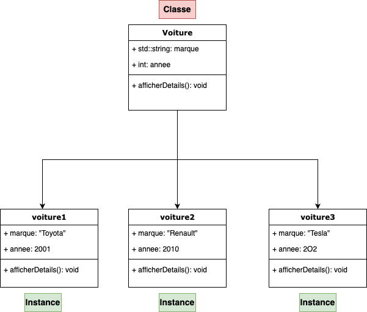

# La Programmation Orientée Objet

La POO est un paradigme de programmation qui utilise des "objets" pour modéliser des éléments du monde réel. Les objets sont des instances de classes, qui définissent leurs propriétés et comportements.

## **Classes et Objets**

Les classes représentent des élément de notre programme qui existeront en plusieurs exemplaires et qui auront chacune des valeurs et leur propre logique.

Les classes sont composées d’attributs (**variables membres**) ainsi que de méthodes (**fonctions membre**).

On peut voir les classes comme des structures améliorées, qui contiennent, en plus des données, de la logique sous forme de méthodes.

### Exemples de classes

1. **Utilisateur**
   - **Attributs** : identifiant, nom, email, mot de passe (haché), rôle (admin, utilisateur, etc.)
   - **Méthodes** : authentifier(), changerMotDePasse(), afficherProfil()
2. **Session**
   - **Attributs** : idSession, utilisateur, heureDebut, heureFin, adresseIP
   - **Méthodes** : démarrer(), terminer(), estActive()
3. **Pare-feu**
   - **Attributs** : règles, état (activé/désactivé)
   - **Méthodes** : ajouterRègle(), supprimerRègle(), vérifierPaquet()
4. **Cryptographie**
   - **Attributs** : algorithme, clé
   - **Méthodes** : chiffrer(données), déchiffrer(données), générerClé()
5. **Réseau**
   - **Attributs** : adressesIP, sous-réseaux
   - **Méthodes** : scannerPorts(), analyserTrafic(), configurerRoute()

### **Définition d'une Classe**

- **Syntaxe de base** :

```cpp
class NomDeClasse {
	// portée
  public:
      // Attributs (variables membres)
      int attribut;

      // Méthodes (fonctions membres)
      void methode();
};
```

- **Exemple** :

```cpp
class Voiture {
  public:
      std::string marque;
      int annee;

      void afficherDetails() {
          std::cout << "Marque: " << marque << ", Année: " << annee << std::endl;
      }
};
```

### **Création d'un Objet**

Pour utiliser les classes, nous allons les **instancier** pour creer des **objets**.

Une classe n’est pas utilisable en soit. Nous allons creer des variables du type de la classe, et ces variables seront les objets.

- **Instance d'une classe** :

```cpp
Voiture maVoiture;              // Instantiation d'une classe
maVoiture.marque = "Toyota";    // Modification d'un attribut
maVoiture.annee = 2022;         // Modification d'un attribut
maVoiture.afficherDetails();    // Appel d'une méthode
```



## Difference entre structures et classes

- Avec structures:

```cpp
#include <iostream>
#include <string>

struct Personne {
    std::string nom;
    int age;
};

// Méthode pour définir le nom
void setNom(struct Personne& personne,  const std::string& nom) {
    personne.nom = nom;
}

// Méthode pour obtenir le nom
std::string getNom(struct Personne& personne) {
    return personne.nom;
}

// Méthode pour afficher les informations de la personne
void afficherInfos(struct Personne& personne) const {
    std::cout << "Nom: " << nom << ", Age: " << age << std::endl;
}

int main() {
    Personne personne1;
    setNom(personne1, "Alice");
    personne1.age = 12;
    afficherInfos(personne1);

    Personne personne2;
    setNom(personne1, "Bob");
    personne2.age = 21;
    afficherInfos(personne2);

    return 0;
}
```

- Avec les classes:

```cpp
#include <iostream>
#include <string>

class Personne
{
public:
    std::string nom;
    int age;

    // Méthode pour définir le nom
    void setNom(const std::string &n)
    {
        this->nom = n;
    }

    // Méthode pour obtenir le nom
    std::string getNom()
    {
        return this->nom;
    }

    // Méthode pour afficher les informations de la personne
    void afficherInfos()
    {
        std::cout << "Nom: " << this->nom << ", Age: " << this->age << std::endl;
    }
};

int main()
{
    Personne personne1;
    personne1.setNom("Alice");
    personne1.age = 32;
    personne1.afficherInfos();

    Personne personne2;
    personne1.setNom("Bob");
    personne1.age = 12;
    personne1.afficherInfos();

    return 0;
}
```

```cpp
class Personne
{
public:
    std::string nom;
    int age;

    // Méthode pour définir le nom
    void setNom(const std::string &n);
};

void Personne::setNom(const std::string &n)
{
    this->nom = n;
}
```

### Classes et pointeurs

Il est possible d’avoir des pointeurs vers des instances de classes (=objets), et dans ce cas nous accederons à ses membres avec le symbole `->` plutot que le point `.` de la même manière que pour les structures.

```cpp
Classe objet;
Classe *pointeurObjet = &objet;

std::cout << objet.membre << std::endl;
std::cout << pointeurObjet->membre << std::endl;
```

### Le mot-clé this

Afin d’acceder aux membres d’une classe à l’intérieur d'elle même, on utilisera le pointeur spécial `this` qui pointe vers l’instance actuelle de l’objet.

```cpp
class Classe {
public:
	int var;

	int get() {
		return this->var;
	}
	int set(int var) {
		this->var = var;
	}
};
```

## Constructeurs et Destructeurs

### **Constructeurs**

**Définition** :

- Un constructeur est une méthode spéciale d'une classe qui est automatiquement appelée lorsqu'un objet de cette classe est créé. Il initialise l'objet nouvellement créé.
- On s’en servira principalement pour initialiser les variables membre de la classe, allouer la mémoire nécessaire et initialiser le contexte

**Caractéristiques** :

- **Nom** : Le constructeur porte le même nom que la classe.
- **Pas de type de retour** : Contrairement aux autres méthodes, les constructeurs n'ont pas de type de retour, même pas `void`.
- **Automatique** : Il est appelé automatiquement lors de l'instanciation de la classe.

**Surcharge** :

- Les constructeurs peuvent être surchargés, c'est-à-dire que plusieurs constructeurs peuvent être définis dans une même classe, chacun ayant une signature différente (différents paramètres).
- Cela correspond au concept de polymorphisme statique vu précedemment, où une fonction peut avoir plusieur forme, et le compilateur choisit la bonne en fonction des arguments passés.

**Types de Constructeurs** :

- **Constructeur par défaut** : Un constructeur sans paramètres. Si aucun constructeur n'est défini, le compilateur en génère un par défaut.
- **Constructeur paramétré** : Un constructeur qui prend des arguments pour initialiser les attributs de la classe avec des valeurs spécifiques.
- **Constructeur de copie** : Un constructeur qui initialise un objet en le copiant à partir d'un autre objet de la même classe. Sa signature prend un argument qui est une référence constante à un objet de la même classe.

```cpp
class MaClasse {
  public:
      MaClasse() {} // Constructeur par defaut
      MaClasse(int a, float b) {} // Constructeur parametré
      MaClasse(const MaClasse & objet) {} // Constructeur de copie
};
```

**Initialisation des Membres** :

- Les constructeurs peuvent utiliser une liste d'initialisation des membres pour initialiser les attributs avant que le corps du constructeur ne soit exécuté. Cela est souvent plus efficace et nécessaire pour les membres constants ou les références.

```cpp
class MaClasse {
  public:
    int nombre;

    MaClasse(): nombre(0) {}

    // ou

    MaClasse(int n): nombre(n) {}

};
```

- exemple avec Voiture

```cpp
class Voiture {
  public:
      std::string marque;
      int annee;

      // Constructeur par defaut
      Voiture() {
	      marque = "";
	      annee = 0;
      }
      // Constructeur parametré
      Voiture(std::string m, int a) {
	      marque = m;
	      annee = a;
      }
      // Equivalent à
      Voiture(std::string m, int a): marque(m), annee(a) {}

      // Constructeur de copie
      Voiture(const Voiture& v): marque(v.marque), annee(v.annee) {}
};

int main() {
	Voiture v1 = Voiture("Toyota", 2001);
}
```

### **Destructeurs**

**Définition** :

- Un destructeur est une méthode spéciale d'une classe qui est automatiquement appelée lorsqu'un objet de cette classe est détruit. Il nettoie les ressources allouées par l'objet avant que celui-ci ne soit retiré de la mémoire.

**Caractéristiques** :

- **Nom** : Le destructeur porte le même nom que la classe, précédé d'un tilde (`~`).
- **Pas de type de retour** : Comme le constructeur, le destructeur n'a pas de type de retour.
- **Automatique** : Il est appelé automatiquement lorsque l'objet sort de son scope ou est explicitement détruit.

**Unique** :

- Une classe ne peut avoir qu'un seul destructeur. Contrairement aux constructeurs, les destructeurs ne peuvent pas être surchargés.

**Libération des Ressources** :

- Le rôle principal du destructeur est de libérer les ressources que l'objet a acquises durant sa durée de vie, comme la mémoire dynamique, les descripteurs de fichiers, ou les connexions réseau.

**Ordre d'Appel** :

- Les destructeurs sont appelés dans l'ordre inverse de la création des objets. Pour les objets membres d'une classe, leurs destructeurs sont appelés après celui de la classe enveloppante.

**Destructeur virtuel** :

- Si une classe est destinée à être dérivée, il est souvent nécessaire de déclarer son destructeur comme `virtual` pour assurer que le destructeur de la classe dérivée est appelé lorsque l'objet est détruit via un pointeur de la classe de base.
- **Syntaxe** :

```cpp
class NomDeClasse {
  public:
      ~NomDeClasse() {
          // Corps du destructeur
      }
  };
```

- **Exemple** :

```cpp
class Voiture {
  public:
      std::string marque;
      int annee;

      ~Voiture() {
          std::cout << "Destruction de la voiture " << marque << std::endl;
      }
};

int main()
{
    Voiture *v1 = new Voiture();
    delete v1; // suppression de l'objet alloué, appel du destructeur

    if (true)
    { // Nouveau bloc
        Voiture v2;
    } // on quitte le bloc, v2 disparait, destructeur appelé

    Voiture v3;
    // Programme terminé, destructeur appelé
}
```

- Exemple avec allocation de mémoire:

```cpp
class AutoFree {
   public:
       int *tableau;

       AutoFree(int size) {
          tableau = new int [size];
       }
       ~AutoFree() {
          delete [] tableau;
       }
 };

 int main() {
	 Autofree a = Autofree(100);
 } // la mémoire est automatiquement liberée à la fin du programme
```

## Modificateurs de méthodes

### Méthodes statiques

Les méthodes statiques sont des fonction membres d’une classe qui ne sont pas liées à une instance de celle ci. Elles permettent d’effectuer des opérations qui ne dépendent pas de l’état d’un objet

```cpp
class MaClasse {
   public:
       static int staticMethod() {
	       return 0;
       }
 };

 int main() {
	 int a = MaClasse::staticMethod();
 }
```

### Méthodes constantes

On peut rajouter le modifier const apres le prototype d’une methode pour indiquer que celle ci ne modifiera pas les variables membres de la classe.

```cpp
class MaClasse {
   public:
       int a;
       int getter() const {
	       return a;
       }
       int setter(int a) {
	       this->a = a;
       }
 };
```

## Encapsulation, héritage et polymorphisme

### Encapsulation

L’encapsulation consiste à protèger certaines variables ou fonctions membres d’un classe et restreindre leur usage en dehors d’elle même.

Il existe differentes categories d’accès, qui autoriseront ou nous l’accès aux membres sur les objets:

- `public`: Les membres seront accessibles de partout
- `private` : Les membres ne seront accessible que depuis la classe même
- `protected`: Les membres ne seront accessibles que dans la classes et classes heritées

Afin de rendre disponible l’information ou être en mesure de modifier des membres protégées, nous créerons ce que l’on appele des **getters** et **setters**.

Cela peut permettre d'éviter des incohérences dans les données à cause d'une mauvaise utilisation de la classe, ou empecher un comportement anormal.

```cpp
class Voiture {
  private:
      std::string marque;
      int annee;

  public:
      Voiture(std::string &m, int a): marque(m), annee(a) {}

      int getAnnee() { // getter
	      return annee;
      }

      void setAnnee(int a) { // setter
	       if(annee > 0) {
		      annee = a;
	      } else {
		      std::cout << "Erreur annee < 0" << std::endl;
		    }
      }

      // Possible de récupérer la marque
      int getMarquee() { // getter
	      return annee;
      }

      // Impossible de modifier la marque, pas de setter
};

int main() {
	Voiture v1 = Voiture("Toyota", 2001);
	v1.setAnnee(2010);
	std::cout << v1.getAnnee() << std::endl;
}
```

## Heritage

L'héritage est un principe fondamental de la programmation orientée objet (POO) qui permet de créer de nouvelles classes à partir de classes existantes. Cette capacité de dériver une classe de base pour créer une classe dérivée permet de réutiliser du code, de simplifier la maintenance et de promouvoir la modularité.

- **Classe de Base (ou Superclasse)** : La classe dont les propriétés et méthodes sont héritées.
- **Classe Dérivée (ou Sous-classe)** : La classe qui hérite des propriétés et méthodes de la classe de base.

```cpp
class ClasseDeBase {
	public:
	// Membres de la classe de base
};

class ClasseDerivee : public ClasseDeBase {
	public:
	// Membres supplémentaires de la classe dérivée
};
```

Exemple

```cpp
// Classe de base
class Vehicule {
public:
    std::string marque;
    int annee;

    Vehicule(std::string const &m, int a) : marque(m), annee(a) {}

    void afficherDetails() {
        std::cout << "Marque: " << marque << ", Année: " << annee << std::endl;
    }
};

// Classe derivée
class Voiture : public Vehicule {
public:
    // rajout d'attributs supplémentaires
    int nombreDePortes;

    // on n'oublie pas le constructeur de base
    Voiture(std::string m, int a, int portes) : Vehicule(m, a), nombreDePortes(portes) {}

    void afficherDetails() {
        Vehicule::afficherDetails(); // Appel de la methode heritée
        std::cout << "Nombre de portes: " << nombreDePortes << std::endl;
    }
};
```

### Exemples d’héritage de classes

1. **Classe de Base : Compte**
   - **Attributs** : identifiant, nom, email
   - **Méthodes** : afficherProfil(), modifierEmail()
     - **Classe Dérivée : CompteAdministrateur**
       - **Attributs supplémentaires** : permissions
       - **Méthodes supplémentaires** : gérerUtilisateurs(), afficherLogs()
     - **Classe Dérivée : CompteUtilisateur**
       - **Attributs supplémentaires** : historiqueConnexions
       - **Méthodes supplémentaires** : afficherHistoriqueConnexions()
2. **Classe de Base : SystèmeDeFichier**
   - **Attributs** : cheminRacine, espaceLibre
   - **Méthodes** : créerFichier(), supprimerFichier()
     - **Classe Dérivée : SystèmeDeFichierSécurisé**
       - **Attributs supplémentaires** : niveauChiffrement
       - **Méthodes supplémentaires** : chiffrerFichier(), déchiffrerFichier()
     - **Classe Dérivée : SystèmeDeFichierDistant**
       - **Attributs supplémentaires** : urlServeur, tokenAccès
       - **Méthodes supplémentaires** : connexion(), testerDebit()
3. **Classe de Base : Transaction**

   - **Attributs** : montant, date, idTransaction
   - **Méthodes** : validerTransaction(), annulerTransaction()

   **Classe Dérivée : TransactionBancaire**

   - **Attributs supplémentaires** : numéroCompteBancaire
   - **Méthodes supplémentaires** : vérifierSolde(), appliquerFrais()

   **Classe Dérivée : TransactionCryptographique**

   - **Attributs supplémentaires** : adresseWallet
   - **Méthodes supplémentaires** : vérifierSignature(), confirmerTransaction()

4. **Classe de Base : BaseDeDonnees**
   - **Attributs** : urlConnection, connection
   - **Méthodes** : connecter(), deconnecter(), insert(), delete()
     - **Classe Dérivée : BaseDeDonneesSQL**
       - **Attributs supplémentaires** : tables
       - **Méthodes supplémentaires** : select(), outerJoin(), innerJoin()
     - **Classe Dérivée : BaseDeDonneesNoSQL**
       - **Attributs supplémentaires** : collections
       - **Méthodes supplémentaires** : filter()
5. **Classe de Base : ChiffrementSymetrique**

   - **Attributs** : message
   - **Méthodes** : chiffrer(), dechiffrer()

   **Classe Dérivée : ChiffrementSymetriqueAES**

   - **Attributs supplémentaires** : keyLength
   - **Méthodes supplémentaires** : setKeyLength()

   **Classe Dérivée : ChiffrementSymetriqueBlowFish**

   - **Attributs supplémentaires** : pary, sbox
   - **Méthodes supplémentaires** :

### Polymorphisme

Le polymorphisme est l'un des piliers fondamentaux de la programmation orientée objet (POO). En C++, il permet aux objets de différentes classes dérivées d'être traités comme des objets de la classe de base, facilitant ainsi l'écriture de code plus flexible et extensible. Il existe principalement deux types de polymorphisme en C++ : le polymorphisme statique (ou de compilation) et le polymorphisme dynamique (ou d'exécution).

### Statique

Le polymorphisme statique est celui que nous avons vu plus haut pour les surcharges de fonctions. Il est possible de declarer plusieurs méthodes dans une classe qui ont le même nom mais différents arguments.

Le polymorphisme statique est résolu au moment de la compilation. Le choix est fait en fonction des arguments utilisés.

```cpp
#include <iostream>

class Calculateur {
public:
    int ajouter(int a, int b) {
        return a + b;
    }

    double ajouter(double a, double b) {
        return a + b;
    }
};

int main() {
    Calculateur calc;
    std::cout << "Addition de deux entiers : " << calc.ajouter(3, 4) << std::endl;
    std::cout << "Addition de deux doubles : " << calc.ajouter(3.5, 4.2) << std::endl;
    return 0;
}
```

### Dynamique

Le polymorphisme dynamique est résolu au moment de l'exécution et est généralement implémenté à l'aide de pointeurs ou de références à des classes de base. Il repose sur l'utilisation de fonctions virtuelles.

Une fonction virtuelle est une fonction membre qui peut être redéfinie dans une classe dérivée. Pour qu’une fonction soit virtuelle, il faut rajouter le mot clé `virtual` lors de sa definition.

Lorsqu'une fonction virtuelle est appelée sur un objet via un pointeur ou une référence à la classe de base, la version de la fonction qui est exécutée est déterminée par le type de l'objet réel, et non par le type du pointeur ou de la référence.

Cette technique est souvent utilisée pour manipuler differents objets dont l'implementation peut etre differente, mais dont l'utilisation est la même (on peut accelerer et freiner avec une voiture, sans avoir besoin de savoir si le moteur est diesel ou essence)

Attention, si on place un objet de classe herité dans une variable de type de la classe mère (sans pointeur), les methodes de la classe mère seront appelés

```cpp
#include <iostream>

class Animal
{
public:
    virtual void parler() const
    {
        std::cout << "L'animal fait un bruit." << std::endl;
    }
};

class Chien : public Animal
{
public:
    void parler() const
    {
        std::cout << "Le chien aboie." << std::endl;
    }
};

class Chat : public Animal
{
public:
    void parler() const
    {
        std::cout << "Le chat miaule." << std::endl;
    }
};

int main()
{
    Animal chienA = Chien();
    Animal *chienB = new Chien();
    Animal *chat = new Chat();

    chienA.parler();    // Animal
    chienB->parler();   // chien
    chat->parler();     // chat

    return 0;
}
```

### Classes abstraites

Une classe abstraite est une classe qui ne peut pas être instanciée et qui est destinée à être une classe de base pour d'autres classes. Elle contient au moins une méthode virtuelle pure. On ne pourra pas l’instancier. Elle sert à définir une interface commune pour les classes dérivées.

**Méthode Virtuelle Pure** : Une méthode virtuelle pure est déclarée en assignant `0` à la déclaration de la méthode virtuelle dans la classe de base.

```cpp
#include <iostream>

class Forme {
public:
    virtual void dessiner() const = 0; // Méthode virtuelle pure
};

class Cercle : public Forme {
public:
    void dessiner() const {
        std::cout << "Dessiner un cercle." << std::endl;
    }
};

class Rectangle : public Forme {
public:
    void dessiner() const {
        std::cout << "Dessiner un rectangle." << std::endl;
    }
};

void afficherForme(const Forme &f) {
    f.dessiner();
}

int main() {
    Cercle cercle;
    Rectangle rectangle;

    afficherForme(cercle);     // Affiche : Dessiner un cercle.
    afficherForme(rectangle);  // Affiche : Dessiner un rectangle.

		Forme f; // Erreur de compilation

    return 0;
}
```
