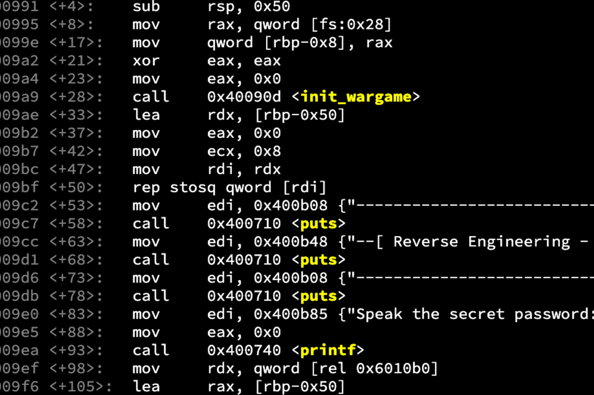
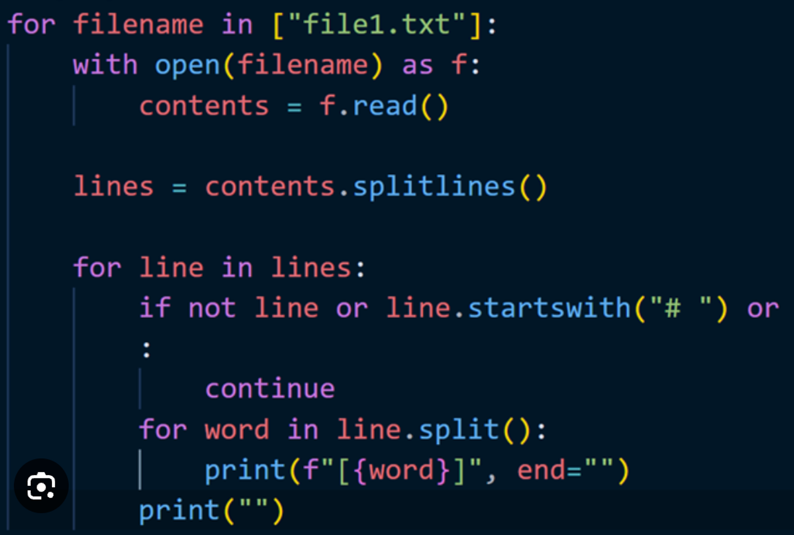
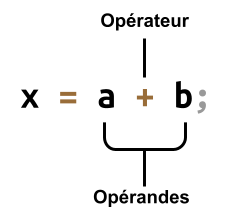
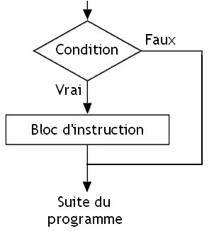
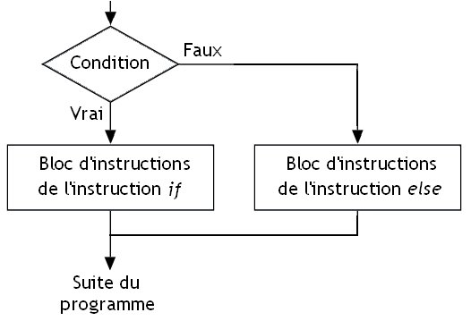
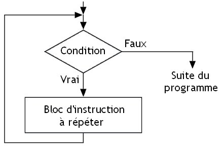
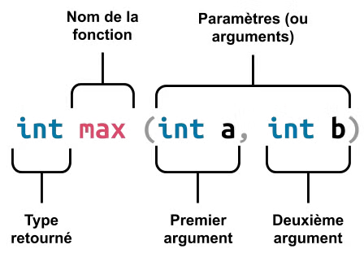
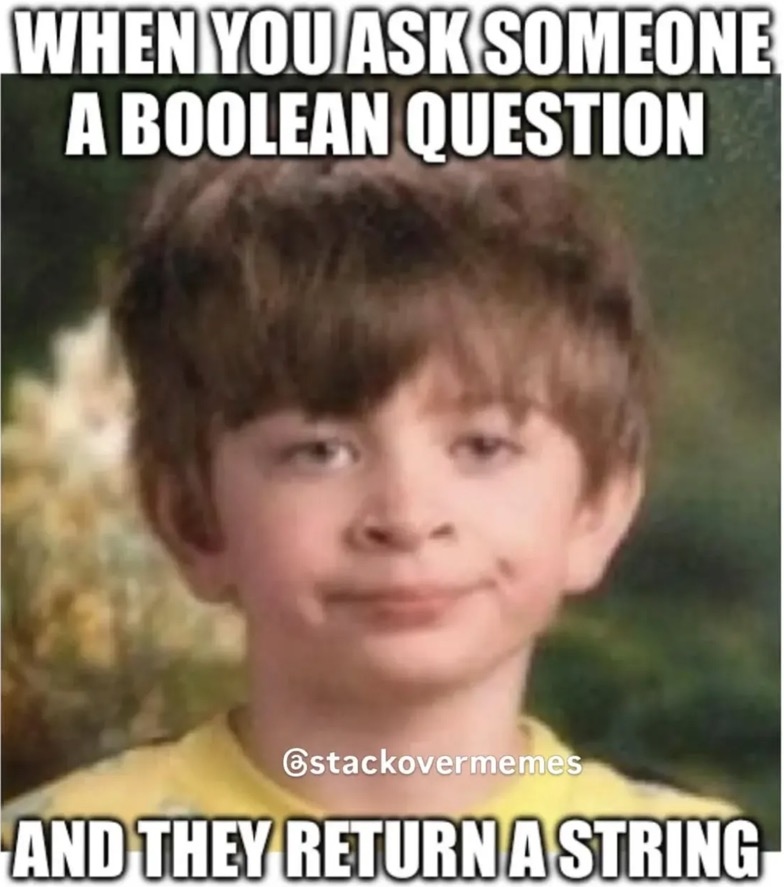

# Langage C: Bases

## Ressources

https://cheatsheets.zip/c

### Cours

Voici quelques cours disponibles en ligne, complets et avec des exercices:

https://lucidar.me/fr/c-class/learn-c-programming/

https://zestedesavoir.com/tutoriels/755/le-langage-c-1/

https://openclassrooms.com/fr/courses/19980-apprenez-a-programmer-en-c

https://moodle.insa-lyon.fr/course/view.php?id=5199

### Exemples en cybersecurité

- https://wargames.ret2.systems/
- https://overthewire.org/wargames/

##

# I. Introduction au Langage C

## A. Histoire et importance du langage

C Le langage de programmation C a été créé au début des années 1970 par Dennis Ritchie au sein des laboratoires Bell. Il a été conçu pour être utilisé avec le système d'exploitation UNIX, également développé à Bell Labs. Depuis lors, le C est devenu l'un des langages les plus utilisés et a eu une influence considérable sur de nombreux autres langages de programmation, notamment C++, Java et Python.

L'une des raisons de la popularité du C est sa flexibilité et sa portabilité. Les programmes écrits en C peuvent être exécutés sur différents types de machines avec peu ou pas de modification. Cette caractéristique a fait du C le langage de choix pour le développement de systèmes d'exploitation, de langages de programmation, de compilateurs et de nombreux autres logiciels de bas niveau.

On considère le C comme un langage “mid-level”, car il n’est pas bas niveau à proprement parler car pas directement du langage machine, mais nécessite beaucoup d’efforts notamment en terme de gestion de la mémoire, donc il n’est plus considéré comme un langage de haut niveau.

<div style="display: flex; justify-content: space-between; gap: 10px;">
<div class="flex flex-col items-center">

<p>Code Assembleur “Bas Niveau”</p>
</div>
<div class="flex flex-col items-center">

<p>Code Python “Haut niveau”</p>
</div>
</div>

## B. Les domaines d'application du C

### Où le C est utilisé

Le langage C est utilisé dans une variété de domaines en raison de sa rapidité, de son efficacité et du niveau de contrôle qu'il offre sur le matériel informatique. Voici quelques domaines clés où le C est particulièrement populaire :

- Développement de systèmes d'exploitation (Windows, Linux, MacOS (BSD), Android)
- Programmation de systèmes embarqués (voitures, avions, fusées, terminaux de paiements, communications…)
- Développement de drivers et de noyaux
- Programmation de jeux vidéo et de moteurs graphiques
- Applications nécessitant des performances élevées, comme la simulation et le traitement de données
- Outils de développement logiciel, y compris les compilateurs et les interpréteurs pour d'autres langages
- Développement de shaders: des mini-programmes graphiques exécutés en parallèle par le GPU [_exemple_](https://www.shadertoy.com/view/XcXXzS)

### Où le C n’est pas utilisé

N’étant pas un langage moderne et simple, le C n’est pas utilisé pour beaucoup de choses aujourd’hui. En effet, certaines choses très rapides dans certains langages peuvent rapidement devenir très fastidieux en C. Quand on peut se permettre d’utiliser plus de ressources (calcul, mémoire, pas en embarqué par exemple), les développeurs vont se porter vers des langages plus modernes tels que Python.

- Applications mobiles
- Applications Web (Frontend/Backend)

## C. Le C et la Cybersécurité

Le C est principalement utilisé pour les systèmes critiques, tels que les systèmes d’exploitation, drivers et systèmes embarqués. Ces systèmes se doivent d’être extrêmement sécurisés car ils sont la base de nombreux outils critiques.

En tant qu’expert en Cybersécurité, connaitre le langage C de manière approfondie est un atout incontestable. En effet, à mi-chemin entre un langage de bas niveau et de haut niveau, il permet d’écrire rapidement des programmes tout en gardant un contrôle total sur sur comportement vis à vis de la machine sur lequel il tourne. Comprendre ce langage en profondeur permet de comprendre comment fonctionnent les ordinateurs en interne.

La plupart des failles critiques en informatiques exploitées par les hackers sont des vulnérabilités liées à la mauvaise gestion de la mémoire par les programmeurs (buffer-overflow, write-after-free, null-pointers). Apprendre le C permet de comprendre comment la mémoire d’un ordinateur fonctionne, mets en garde sur les erreurs à ne pas faire et comment se protéger des hackers.

Les langages dits de plus haut niveau (~python) sont plus lents, plus lourds et ne donne pas la main directe à la mémoire, ce qui résulte en des programmes moins sûrs, plus sujets aux vulnérabilités car dépendants à trop de couches entre eux et la machine.

Ce contrôle supplémentaire sur la mémoire qu’apporte le C doit cependant être parfaitement maitrisé, autrement il en résulte parfois des conséquences dramatiques.

### Faits divers

[**Crowdstrike**](https://fr.wikipedia.org/wiki/Panne_informatique_mondiale_de_juillet_2024)

> La **panne informatique mondiale du [July 19, 2024](https://fr.wikipedia.org/wiki/19_juillet)July 19, 2024[July 19, 2024](https://fr.wikipedia.org/wiki/Juillet_2024)July 19, 2024[July 19, 2024](https://fr.wikipedia.org/wiki/2024_en_informatique)** est causée par la [mise à jour](<https://fr.wikipedia.org/wiki/Mise_%C3%A0_jour_(informatique)>) de *Falcon Sensor*, un logiciel développé par la société de [cybersécurité](https://fr.wikipedia.org/wiki/Cybers%C3%A9curit%C3%A9) américaine [CrowdStrike](https://fr.wikipedia.org/wiki/CrowdStrike). Cette mise à jour défectueuse provoque partout à travers le monde le [plantage](https://fr.wikipedia.org/wiki/Plantage) d'environ 8,5 millions d'ordinateurs et serveurs utilisant le système d'exploitation [Microsoft Windows](https://fr.wikipedia.org/wiki/Microsoft_Windows), causant d'importantes perturbations, essentiellement au sein des entreprises. Le [_cloud_](https://fr.wikipedia.org/wiki/Cloud_computing) de [Microsoft](https://fr.wikipedia.org/wiki/Microsoft) est aussi partiellement tombé en panne ce jour là, mais un peu avant et donc sans rapport avec la mise à jour défectueuse.

Divers secteurs économiques sont affectés tels que les aéroports, les banques, les hôtels, les hôpitaux, la grande distribution, les marchés financiers, la restauration, des services de diffusion gouvernementaux comme les [numéros d'appels d'urgence](https://fr.wikipedia.org/wiki/Num%C3%A9ro_d%27appel_d%27urgence) et des sites internet.

https://x.com/perpetualmaniac/status/1814376668095754753?s=46&t=GrgUv84ThhjJMTYOeBX-2g

[**Ariane**](https://fr.wikipedia.org/wiki/Vol_501_d%27Ariane_5)

Le **vol 501** est le vol inaugural du [lanceur](<https://fr.wikipedia.org/wiki/Lanceur_(astronautique)>) [européen](https://fr.wikipedia.org/wiki/Europe) [Ariane 5](https://fr.wikipedia.org/wiki/Ariane_5), qui a eu lieu le June 4, 1996. Il s'est soldé par un échec, causé par un dysfonctionnement informatique,

https://lucidar.me/fr/c-class/lesson-02-06-ariane-flight-501/

### L’avenir du C ?

Le C va continuer à être utilisé pendant un moment car il représente encore une grosse part des outils critiques encore utilisé aujourd’hui. Cependant, le risque qu’il apporte en terme de gestion de mémoire est problèmatique et des solutions commencent à apparaitre. D’autres langages dits “memory-safe” existent, mais un en particulier, le **Rust**, commence à faire sa place. Certains composants du noyaux Linux ont déjà étés réécrits dans ce langage. Il a l’avantage d’être très similaire au C++, mais avec un atout majeur: il est impossible de faire des erreurs de mémoire avec (plus de “null pointer”, pas d’ecriture en zone non autorisée)

## D. Installation de l'environnement de développement

Pour commencer à programmer en C, vous aurez besoin d'un environnement de développement qui comprend un éditeur de texte et un compilateur.

### Coder en ligne

Pour débuter simplement, il est possible d’utiliser un éditeur de code en ligne

https://www.programiz.com/c-programming/online-compiler/

### Coder localement

Nous recommandons l’utilisation de [Visual Studio Code](https://code.visualstudio.com/) avec l’extension C/C++ pour un acces rapide aux outils nécessaires.

Pour installer les outils nécessaires, suivre les instructions sur ce site:

https://code.visualstudio.com/docs/languages/cpp

> **TLDR**: Pour **windows**, Allez sur [cette page](https://visualstudio.microsoft.com/downloads/#remote-tools-for-visual-studio-2022) et telechargez "Build Tools for Visual Studio 2022"

Si on ne souhaite pas utiliser Visual Studio, il faut au moins un éditeur de texte et le compilateur `gcc` à disposition

_Conseil_: activer l’auto save: Aller dans Settings (Cmd/Ctrl + ,) chercher `auto save` et choisir `onFocusChange`

## E. Structure d'un programme C

Un programme C est composé de fichiers texte avec l’extension `.c`

Voici un exemple simple d’un programme:

```c
// Préprocesseur
#include <stdio.h>
#include <stdlib.h>

// Fonction principale
int main()
{
  /*
  Afficher un message dans le terminal
  */
  printf("Hello world!\n");

  return 0;
}
```

Chaque programme doit avoir **une seule** fonction `main` qui est executée au demarrage du programme. La structure de base d'un programme C comprend des directives de préprocesseur, des déclarations de variables, des définitions de fonctions et des commentaires.

Décomposons cet exemple:

### Inclusions

Les directives commençant par un symbole `#` sont appelés des instructions de **préprocesseurs**. Nous y reviendrons plus tard, mais ici nous avons affaire à des inclusions de librairies standard.

### Commentaires

Il est possible d’ecrire des remarques dans le code qui ne serviront qu’a la personne qui le lira et n’affectera en rien le programme. Cela peut aider pour expliquer ce qui se passe dans le programme à d’autres personnes. Les commentaires sont precedés de `//` sur une seule ligne, ou entourées de `/*` et `*/` quand on ecrit sur plusieurs lignes. Ces parties sont généralement colorés en gris dans les éditeurs.

### Fonction principale

Nous avons ensuite la fonction `main` qui est déclarée et qui sera lancée au début du programme. Une fonction contient un ensemble de code entre ses accolades `{` et `}`

### Affichage

L’appel de la fonction `printf` permet d’afficher quelque chose dans le terminal qui execute le programme. Elle appartient a la librairie standard `stdio`

### Retour

La fonction `main` retournera la valeur 0, ce qui annonce que le programme s’est bien déroulé.

## F. Compilation et exécution d'un programme

La compilation est le processus par lequel le code source C est transformé en code machine que l'ordinateur peut exécuter.

### **Les langages interprétés**

Un langage interprété nécessite l'utilisation d'un interpréteur qui va exécuter le code source. L'interpréteur est un programme intermédiaire qui analyse et exécute les lignes (généralement une par une). Les langages interprétés les plus populaires sont : MATLAB, PHP, Python, Java ... Chacun de ces langages nécessite l'installation de l'interpréteur associé pour fonctionner.


### **Les langages compilés**

Avec les programmes compilés, l'exécution se fait en deux étapes :

1. Le code source est d'abord transformé en langage machine.
2. Ensuite le code transformé est directement exécuté dans le processeur

La première étape, la transformation du code source en langage machine est appelée **compilation**. La sortie de la compilation est un fichier exécutable, typiquement un fichier `.exe` sous Windows. Voici quelques exemples de langages compilés : C, C++, C#, swift, Pascal...


De manière générale, les langages compilés sont plus performants, car ils sont exécutés directement dans le processeur. Pour avoir un ordre de grandeur, cette [page](https://towardsdatascience.com/how-fast-is-c-compared-to-python-978f18f474c7) présente une comparaison entre Python et C++. Le même programme dure 15 minutes en Python, contre 30 secondes en C++. Le graphique ci-dessous donne un ordre de grandeur des ratios d'exécution des différents langages. On s'aperçoit que le C est 10 fois plus rapide que PHP 7 et 40 fois plus rapide que le même programme en Python.


La contrepartie est la durée de compilation : si elle est généralement instantanée, elle peut parfois être beaucoup plus longue sur de gros projets. Par exemple la compilation d'un noyau Linux peut durer une dizaine d'heure. Évidemment, si le code source n'est pas modifié, il est inutile de relancer la compilation avant chaque exécution.

### Compilation

Le compilateur le plus connu pour le C s’appelle **gcc**. Il est exécutable en ligne de commande.

::: info 💡

Ne pas confondre éditeur de code et compilateur:

L’éditeur de code (Visual Studio Code) est un simple éditeur de texte qui enregistre des fichiers texte. Grace à ses outils et plugin il permet de simplifier le travail du développeur.

Le compilateur (gcc) va transformer les fichiers texte en fichiers exécutables par l’ordinateur.

:::

Pour compiler un fichier, il faut lancer la commande suivante:

_Linux/Mac_

`gcc -Wall main.c -o main`

_Windows_

`gcc -Wall main.c -o main.exe`

- `gcc` : appel du programme
- `-Wall` Afficher tous les warnings
- `main.c` : fichiers source à compiler
- `-o main` : enregistrer le resultat (**o**utput) dans le fichier `main`

Nous avons maintenant un fichier `main` (linux/mac) ou `main.exe` (windows).

### Execution

Nous créerons ici principalement des programmes qui seront exécutés en _ligne de commande_.

Une fois que votre terminal est ouvert et que vous êtes dans le repertoire du programme, vous pouvez le lancer avec ces commandes:

`./main` _// Linux/Mac_

`./main.exe` _// Windows_

Vous verrez alors s’afficher les sorties de votre programme.

Sous Linux/Mac on peut faire les deux en même temps via l’opérateur `&&`

`gcc main.c -o main && ./main`

### Erreurs de compilation

Si le code que l’on essaie de compiler contient des erreurs, la compilation échouera et le compilateur nous donnera des indications sur les problemes pour nous aider à les resoudre. Bien décoder ces messages d’erreur sera d’une grande aide pour corriger les problemes.

```jsx
/tmp/wBHb2sextG.c: In function 'main':
ERROR!
/tmp/wBHb2sextG.c:6:32: error: expected ';' before 'return'
6 |     printf("Try [programiz.pro](http://programiz.pro/)")
|                                                           ^
|                                                           ;
7 |
8 |     return 0;
|     ~~~~~~
```

Ici le message nous indique que nous avons oublié un `;` ligne 6

# II. La Syntaxe en C

Un code en C est régi par des règles strictes qu’il faut impérativement respecter pour que le programme aie le comportement que l’on désire et même qu’il compile.

### Les mots-clés et identificateurs

Les **mots-clés** sont des mots réservés en C qui ont une signification spéciale pour le compilateur. Ils ne peuvent pas être utilisés comme noms de variables ou de fonctions. Des exemples de mots-clés incluent `int`, `return`, `if`, et `while`.

Les **identificateurs**, en revanche, sont les noms donnés par le programmeur aux variables, fonctions, tableaux, etc. Ils doivent commencer par une lettre ou un underscore et peuvent être suivis de lettres, de chiffres ou d'underscores.

### Instructions

Celui ci est séparé en instructions, elles mêmes séparées par des points-virgules `;`

Les instructions sont:

- déclaration de variable
- affectation de variable
- appel de fonction

Les instructions ne sont pas:

- conditions
- boucles
- préprocesseur

```c
// premiere instruction
int a = 0;
// deuxieme instruction
float b = 1.0;
// troisieme instruction
if(a > 2) {
	printf("oui");
}
```

Les sauts de ligne et les espacements n’ont pas d’impact sur l’interprétation du code, en revanche il aide grandement à la lisibilité.

Le code précedent est strictement équivalent au suivant, mais ce dernier est bien moins lisible:

```c
int a=0;float b=1.0;if(a>2){printf("oui");}
```

### Bloc

Un bloc est un morceau de code englobé par des accolades `{` et `}`

Il est utilisé pour les fonctions, boucles et conditions.

Les variables qui sont déclarées dans un bloc **ne sont valides que dans ce bloc**. Cela signifie que en dehors de ses limites (accolades), elles n’existent pas.

Lors de l’entrée dans un bloc, on indente d’une colonne (voir paragraphe suivant).

```c
int a = 5;
if(a < 2) {
	int b = 5;
	printf(b);
}
if(a > 2) {
	printf(b); // b n'existe pas ici
}
```

```c
int a = 5;
if(a < 2) {
	int b = 5;
	printf(b);
}
if(a > 2) {
	int b = 4;
	printf(b); // b existe ici mais est differente
}
```

Ici dans le deuxième bloc on tente de lire b, mais elle a été déclarée dans un autre bloc, on aura donc une erreur de compilation.

Il est en revanche possible d’imbriquer des blocs, et d’acceder aux variables du bloc supérieur (pas inférieur)

```c
int a = 5;

if(a < 10) {
	int b = 5;
	printf(b);

	if(a > 2) {
		printf(b); // b existe
		int c = 12;
	}
	printf(c); // c n'existe pas ici
}
```

### Indentation

L’indentation est l’alignement vertical du code, qui doit correspondre au bloc dans lequel est le code.

Quand on ouvre un bloc, on indente d’un cran vers la droite, quand on ferme un bloc, désindente vers la gauche.

```c
int main() {    // nouveau bloc
	int a = 0;    // Indenté d'un cran
	int b = 0;    // meme bloc, meme cran

	if(a == b) {  // nouveau bloc
		int c = 0;  // Indenté d'un cran
	}             // bloc fermé, on désindente

	int d = 0;
}                // bloc fermé, on désindente
```

Sur Visual studio, vous pouvez activer l’indentation automatique.

Aller dans Settings (Cmd + ,) chercher `format on save` et activer Editor Format On Save

::: info 💡

Lors des évaluations il est impératif de rendre un code propre, c’est a dire clair, bien indenté, bien commenté, sans superflu

:::

# III. Les variables

Comme dans tous les langages de programmation, le C utilise des variables. Les variables peuvent contenir des entiers, des réels, du texte .... Contrairement aux *constantes*, le contenu des *variables* est amené à changer au cours de l'exécution d'un programme.

Ces variables serviront a stocker et manipuler les informations que nous devront calculer, telles que des données, des messages, des images, ou des équations. Un ordinateur est avant tout une machine a compter (_computer_), notre rôle de programmateur est de faire faire aux machines les opérations qui nous rendront les services que l’on attend.

## **A. Un langage typé**

Le C est un langage typé, c'est-à-dire que chaque variable est définie pour un type donné (entier, réel, texte...) :

- Pour utiliser une variable, on doit **déclarer** son **type** _et_ son **nom:**

```c
int nombre;
```

Ici on a déclaré une variable de type `int`, qui s'appelle `nombre`

La déclaration sert à allouer la mémoire nécessaire au stockage de la variable.

- Pour stocker une valeur dans une variable, on effectue une **affectation** via l’opérateur `=`

```c
nombre = 10;
```

- On **peut** affecter une valeur d’une variable lors de sa déclaration

```c
int nombre = 10;
```

## B. Types de variables

En C, on peut distinguer 3 classes principales de types de variables :

- Les entiers (`int`) qui servent à mémoriser des nombres entiers, sans virgule : 0, 1, 25, -1024 ...
- Les flottants (`float`) qui servent à mémoriser des nombres réels, donc à virgule : 0.2 , 15.5, -3.1415 ...
  - Dans la plupart des langages, les virgules sont représentées par des points `.` et non pas des virgules comme en français, qui elles représentent plutôt des séparateurs.
- Les caractères (`char`) qui servent à mémoriser des caractères alpha-numérique : A, B, C ... Z, 0, 1, 2 ...9, ?, /, %, # ...
  - Les caractère sont écrits entre simple apostrophes en C : `'a'`

### Tailles

Chaque type de variable a un usage different et surtout prendra une place différente dans la mémoire. Plus il prendra de place dans la mémoire, plus ses valeurs pourront êtres elevées.

::: info 💡

Avec 1 bit on peut compter jusqu’a 1, avec 2 bits, jusqu’à 3, 3 bits jusqu’à 7, etc…

Avec X bits on peut compter jusqu’a `2^X-1`

:::

### Signes

Chaque type peut être précédé du mot clé `unsigned` qui signifiera que ses valeurs démarreront de zero, donc pas de valeurs négatives. Cela doublera donc leur capacité.

Si une variable est signée, sa plage de valeurs est divisée par deux et partagée entre les nombres négatifs et positifs

### Tailles et plages de valeurs

| Type            | Taille (bits) | Taille (octets) | Borne inférieure     | Borne supérieure        |
| --------------- | ------------- | --------------- | -------------------- | ----------------------- |
| `char`          | 8 bits        | 1               | -128                 | +127                    |
| `unsigned char` | 8 bits        | 1               | 0                    | 255                     |
| `int`           | 32 bits       | 4               | -2,147,483,648       | +2,147,483,647          |
| `unsigned int`  | 32 bits       | 4               | 0                    | 4,294,967,295           |
| `long`          | 64 bits       | 8               | -9223372036854775808 | +9223372036854775807    |
| `float`         | 32 bits       | 4               | 1.2E-38              | 3.4E+38 (6 décimales)   |
| `double`        | 64 bits       | 8               | 2.3E-308             | 1.7E+308 (15 décimales) |

_Ces informations sont données a titre d’exemple, elles peuvent changer selon le compilateur et le système d’exploitation cible_

_Pour rappel 1 octet = 8 bits_

### Booléens

Les booléens sont des chiffres ne pouvant représenter que deux valeurs, à l’image d’un bit. On nomme ces valeurs soit “vrai” ou “faux” (”true/false”), représentés par l’entier 1 (vrai) ou 0 (faux)

## C. La mémoire

### Dépassement

Si la valeur d’une variable dépasse ses bornes, sa valeur fera le tour et rejoindra l’autre borne.

Par exemple:

```c
char heure = 127;
heure = heure + 1;
// heure == -128
```

[_Lire plus sur le dépassement d’entiers_](https://fr.wikipedia.org/wiki/D%C3%A9passement_d%27entier)

### Représentation en mémoire

Un ordinateur ne connait que les bits, et ne sait pas compter jusqu’a 10. Les variables seront donc représentées en une série de bit en mémoire qui représentera sa valeur en fonction de son type.

Voici comment sont représentées les valeurs d’un `unsigned char` de 8 bits:

| Base 10 | Base 2   |
| ------- | -------- |
| 0       | 00000000 |
| 1       | 00000001 |
| 2       | 00000010 |
| …       |          |
| 254     | 11111110 |
| 255     | 11111111 |

C’est pour cela que si on additionne 255 + 1 on obtient 0

## D. Nomenclature

> _There are only two hard things in Computer Science: cache invalidation and naming things._
>
> - _- Phil Karlton_

### Noms

Afin que le compilateur puisse distinguer le nom des variables du reste du code, il existe des restrictions sur le nommage des variables.

Les noms de variables:

- doivent représenter ce qu’elles stockent
- peuvent être composés de plusieurs caractères.
- peuvent contenir des lettres minuscules ou majuscule (`a à z et A à Z`).
- peuvent contenir des chiffres (`0 à 9`).
- peuvent contenir un tiret bas (`_`).
- ne peuvent pas commencer par un chiffre.
- ne peuvent pas etre des **mots clés** du langage (`main`, `return`, `int` ...).

### Casing

Il est préférable de garder une consistence dans la manière dont on nomme les variables qu’on appelle la casse: [lire plus ici](https://laconsole.dev/blog/cases-camel-pascal-snake-kebab-upper/)

Par exemple:

```c
int couleurVoiture;   // camelCase
int couleur_voiture;  // snake_case
int CouleurVoiture;   // PascalCase
#DEFINE COULEUR_VOITURE;  // UPPER_CASE
```

# IV. Entrées et sorties

Afin de pouvoir être interactif, un programme peut recevoir et envoyer des informations à l’utilisateur où à d’autre programmes.

Pour les débuts nous utiliseront principalement des programmes en ligne de commande, donc les sorties seront simplement ce que l’on verra apparaitre dans le terminal et les entrées ce qu’on pourra taper au clavier dedans.

Le C utilise des fonctions de la bibliothèque standard pour l'entrée et la sortie de données. La bibliothèque `<stdio.h>` contient des fonctions comme `printf()` pour l'affichage de sortie et `scanf()` pour la saisie d'entrée. Ces fonctions permettent d'interagir avec l'utilisateur en lisant des données du clavier et en affichant des résultats à l'écran.

```c
#include <stdio.h>
```

## A. Affichage avec `printf`

Pour afficher du texte dans le terminal, nous utiliserons principalement la fonction `printf` qui signifie “print formatted” ou afficher de manière formatée. On va lui donner une chaine de caractères qui pourra contenir des variables.

Les variables dans la chaine de caractères seront symbolisée par `%d` où `d` représentera le type de la variable, puis on passera les variables en argument de la fonction dans l’ordre dans lequel elles apparaissent dans la chaine de caractère.

Pour sauter une ligne, nous écrirons `\n`

### Exemple

```c
printf("Bonjour !\n");

int age = 25;
printf("%d", age);

// > 25
```

Cette syntaxe sera plus claire quand les bases seront connues entièrements, mais expliquons ce qui se passe ici:

- `printf(...)` on appelle la fonction `printf`
- `"%d"` le premier argument de la fonction représente ce que l’on veut afficher et dans quel format. Ici on va juste afficher un entier
- `age` est l’entier que l’on veut afficher

Exemple plus complet:

```c
int age = 25;
int departement = 33;
printf("Age: %d Département: %d", age, departement);
// > Age: 25 Département: 33
```

Ici on a mélangé du texte brut avec des variables.

### Types de variables à afficher

| Type               | Code de format | Types                                            |
| ------------------ | -------------- | ------------------------------------------------ |
| entiers signés     | `%d`           | `char`, `int`, `long`                            |
| entiers non signés | `%u`           | `unsigned char`, `unsigned int`, `unsigned long` |
| flottants          | `%f`           | `float`, `double`                                |
| caractère          | `%c`           | `char`, `unsigned char`                          |

## B. Entrée avec `scanf`

Dans le sens inverse, si on veut récupérer une valeur à l’utilisateur, on va utiliser `scanf`

Son utilisation est très similaire à printf, sauf qu’on utilisera des `&` avant les variables à enregistrer.

Ce détail sera vu en profondeur dans le module de C avancé, mais pour faire court, c’est un moyen qui permettra a `scanf` de modifier les valeurs des variables qu’on lui passe. Sans le symbole `&` , les fonction ne peuvent que lire les variables qui lui sont passés en arguments.

### Exemple

```c
#include <stdio.h>

int age;
printf("Quel est votre age ?\n");
scanf("%d", &age);
printf("Vous avez %d ans.\n", age);
```

::: info 🚧

Faire les exercices “Basiques”

:::

# V. Opérateurs

Les opérateurs permettent d’effectuer des opérations mathématiques entre plusieurs valeurs, telles que des additions ou des comparaisons.



## A. Opérations arithmétiques

Ce sont les opérations mathématiques de bases telles que l’addition. On va juste additionner deux nombres et on aura un résultat.

```c
// addition
c = a + b;
// soustration
c = a - b;
// division
c = a / b;
// multiplication
c = a * b;
// modulo
c = a % b;
```

### Opérateurs unaires

Certains opérateurs ne prennent qu’un une opérande, tel que l’inversion:

```c
c = -a;
```

### Opérateurs d’affectation

Pour écrire du code plus vite, il existe des raccourcies appelés opérateurs d’affectation:

```c
a += b;   /* == */   a = a + b;
a -= b;   /* == */   a = a - b;
a *= b;   /* == */   a = a * b;
a /= b;   /* == */   a = a / b;
a %= b;   /* == */   a = a % b;
```

### Opérateurs d’incrémentation

Il arrive très souvent de devoir augmenter ou diminuer de `1` une variable, il y a donc un opérateur spécial pour cela:

```c
i++;    /* == */  i = i + 1;
i--;    /* == */  i = i - 1;
```

On peut aussi inverser le sens de l’opérateur, ce qui changera la valeur de retour: `++i` ou `--i`

Pour `i++` la valeur retournée est la valeur non incrémentée, alors que pour `++i` la valeur incrémentée est retournée.

**_Exemple_**

```c
int a = 2;
int b = a++; // a == 3, b == 2
int c = ++a; // a == 4, c == 4
```

### Modulo

Le modulo est un opérateur qui retourne le **reste de la division euclidienne** de deux nombres.

C’est un opérateur très important en programmation et est très souvent utilisé, il est important de bien le maitriser.

::: info 💡

### **Rappel**

Une division **traditionnelle** peut retourner des valeurs décimales. Par exemple, 3/2 retourne 1,5.

Une division **euclidienne** retournera deux valeurs entières distinctes: un **quotient** et un **reste.**

Par exemple la division euclidienne de 7 par 2 donne: `7 = 2 * 3 *(quotient)* + 1 *(reste)*`

[_Lire plus sur wikipedia_](https://fr.wikipedia.org/wiki/Division_euclidienne)

:::

Exemples:

```c
3 % 2 == 1
5 % 2 == 1
4 % 3 == 1
5 % 3 == 2
```

Si le reste de la division euclienne de `a` par `b` vaut 0, alors cela signifie que `a` est divisible par `b`

`8 % 4 == 0` ⇒ 8 est divisible par 4

Dans le cas d’un dépassement de valeurs d’une variable, on peut expliquer une nouvelle valeur via le modulo.

Par exemple, pour un `unsigned char` qui a ses valeurs bornées entre 0 et 255, une affectation en valeur peut être succédée d’un modulo 256:

```c
unsigned char a;

a = 1;              // équivalent à
a = 1 % 256;        // a == 1

a = 256;            // équivalent à
a = 256 % 256;      // a == 0

a = 257;            // équivalent à
a = 257 % 256;      // a == 1
```

### Résultats des opérations et types de variables

Ne pas oublier le type de variable dans lequel on stocke le résultat d’une variable. Il peut arriver que le résultat soit modifié pour rentrer dans le type de variable de destination, tel qu’un changement de flottant vers entier ou un dépassement de taille

```c
int a = 3/2; // a == 1
float b = 3/2; // b == 1.5
unsigned char c = 200 * 2; // c == 144 (400 % 256)
```

## B. Opérations booléennes

Les opérations booléennes sont des opérations qui prendront plusieurs valeurs et retourneront toujours un booléen qui indiquera un résultat qui ne peut être que soit vrai ou faux.

### Opérations de comparaison

Ce sont des opérateurs de comparaison. Nous allons ici prendre deux valeurs, qui pourront êtres de n’importe quel type, les comparer, et retourner un booléen correspondant au résultat de la comparaison.

Prenons l’égalité `a == b` : si `a` est égal à `b` alors l’opération retournera `1` (vrai), sinon `0` (faux)

```c
// égalité
a == b
// non-égalité
a != b

// a strictement supérieur à b
a > b
// a supérieur ou égal à b
a >= b

// a strictement inférieur à b
a < b
// a inférieur ou égal à b
a <= b
```

On peut tester des opérateurs booléens en les utilisant en tant qu’entiers:

```c
int a = 2;
int b = 3;

int c1 = a == b;  // c1 == 0
int c2 = a != b;  // c2 == 1
int c3 = a < b;   // c3 == 1
int c4 = a <= b;  // c4 == 1
int c5 = a > b;   // c5 == 0
int c6 = a >= b;  // c6 == 0
```

Attention aux comparaisons de valeurs de types différents, on peut avoir des surprises !

### Opérateurs logiques

Les opérateurs logiques fonctionnent avec deux booléens pour en retourner un troisième. Cela va permettre de combiner plusieurs comparaisons pour former des **conditions** plus complexes.

```c
// AND (ET logique)
a && b

// OR (OU logique)
a || b

// NOT (NON logique)
!a
```

### Tableau Opérateurs logiques AND et OR

| A    | B    | ET   | OU   |
| ---- | ---- | ---- | ---- |
| VRAI | VRAI | VRAI | VRAI |
| VRAI | FAUX | FAUX | VRAI |
| FAUX | FAUX | FAUX | FAUX |
| FAUX | VRAI | FAUX | VRAI |

### Tableau Opérateur logique NOT

| A    | NON  |
| ---- | ---- |
| VRAI | FAUX |
| FAUX | VRAI |

_Exemple_

```c
int a = 0;
int b = 1;

int c1 = a && b;    // c1 == 0
int c2 = a || b;    // c2 == 1
int c3 = !a;        // c3 == 1
int c4 = !b;        // c4 == 0
```

On va en général utiliser des comparaisons de chaque cotés:

```c
int a = 5;
int b = 7;
int c = 9;

int c = (a < b) && (b < c);
```

Le **NON** sert à indiquer que l’on ne veut pas qu’une condition se réalise

```c
!(a < b)  == (a >= b) // on ne veut pas que a soit strictement plus petit que b
!(a == b) == (a != b) // on ne veut pas que a égal à b
```

### Loi de Morgan

Elle permet d’inverser des opérateur booléens

```c
(a && b) == !(!a || !b)

// Par exemple:
(p>=0 && p<=100) == !(p<0 || p>100)
```

### Priorité des opérateurs

Comme en mathématiques, les opérateurs ont des priorités pour être sur dans quel ordre ils vont êtres calculés.

Les règles sont strictes mais complexes ([voir ici](https://lucidar.me/fr/c-class/lesson-03-12-operators-precedence/)), il est donc fortement recommandé d’utiliser des parenthèses pour séparer plusieurs opérations afin de ne pas se perdre et garder un code lisible. Si l’opération est trop complexe, séparer en plusieurs opérations

```c
x =  3 * 2 < 4;     // dans quel ordre ?
x =  (3 * 2) < 4;   // d'abord la multiplication !

y = a + b * 2 % 4 >= 3 + c;  // ...
y = a + (((b*2) % 4)  > 3 ) + c; // (un peu) plus clair

y1 = (b*2) % 4;
y = a + (y1 > 3) + c;  // mieux en plusieurs lignes
```

::: info 🚧

Faire les exercices “Opérateurs”

:::

# VI. Contrôles de flux

Les contrôles de flux permettront de réagir conditionnellement au valeurs des variables et répéter des opérations un nombre déterminé de fois

## A. Structures conditionnelles

Les structures conditionnelles permettent d’exécuter ou non certaines parties d’un programme selon les valeurs des variables

### if…else

L'instruction `if...else` permet d'exécuter un bloc d'instructions selon le résultat d'un test

:

_Syntaxe_

```c
if (/* condition*/) {
  // Bloc d'instruction 1
}
else {
  // Bloc d'instruction 2
}
```

Si la _condition_ est vraie alors on exécutera le _bloc 1,_ sinon le _bloc 2._



Il est à noter que :

- il ne faut pas mettre de point virgule à la fin du `if` (ce n’est pas une instruction)
- les parenthèses dans le test sont obligatoires
- le `else{...}` est facultatif
- les accolades peuvent être omises si le bloc ne contient qu'une instruction

Si on veut tester une deuxième condition si la première n’est pas satisfaite on peut utiliser `else if`

_Syntaxe_

```c
if (/* condition 1 */) {
  // Bloc d'instruction 1
}
else if (/* condition 2*/) {
  // Bloc d'instruction 2
else {
  // Bloc d'instruction 3
}
```

Si la _condition 1_ est vraie alors on exécutera le _bloc 1_, sinon si la _condition 2_ est vraie on exécutera le _bloc 2_, sinon le _bloc 3_



::: info ⚠️

**Attention**: dans une structure `if ... else if ... else ...` **un seul des blocs sera executé**: le premier dont la condition est valide.

Si il y a une condition valide (`if` ou `else if`), le prochain bloc sera executé, mais si la condition suivante (`else if` ) est valide aussi elle ne sera pas executée.

:::

_Exemples_

```c
int a = 12;
int b = 24;

if(a > b) {
	printf("a est strictement plus grand que b");
} else {
	printf("a est inferieur ou égal à b");
}

if(a == b)
	printf("a est égal à b");

if(a < b) {
	printf("a est strictement inférieur à b");
}
else if (a == b) {
	printf("a est égal à b");
} else {
	printf("a est strictement plus grand que b");
}
```

Si on veut combiner des conditions, on peut utiliser les opérateurs logiques:

```c
if(a < b) {
	if(b < c) {
		// ...
	}
}

// Equivalent à
if( (a < b) && (b < c) ) {
	// ...
}
```

### Switch

L’opérateur conditionnel `switch` permet de tester différentes valeurs d’une variable

_Exemple_

```c
char lettre = 'a';
switch (lettre) {
  case 'a':
  {
      printf("la lettre a");
      break;
  }
  case 'b':
  {
      printf("la lettre b");
      break;
  }
  default:
  {
      printf("une autre lettre");
  }
}
```

## B. Boucles

Les boucles permettent de répéter un morceau de programme un nombre déterminé de fois.

On appelle un tour de boucle une **itération**

### While

La boucle `while`, “_tant-que_” en français, est la boucle de base en C. Elle va répéter un bloc d’instruction tant qu’une condition est vraie.

_Syntaxe_

```c
while(/* condition */) {
	// bloc d'instruction
}
```

Sa syntaxe est très proche du `if`, si la condition est vraie alors le bloc d’instruction sera -exécuté. A la fin du bloc, la condition sera testée à nouveau. Si elle est encore vraie, le bloc sera rejoué à nouveau. Si il est faux, le programme continuera après le bloc.

Exemple

```c
int a = 0;
while(a < 10) {
	printf("%d", a);
	a++;
}
```

Ici on peut lire la boucle comme “tant que `a` est inférieur à 10, alors éxécuter le bloc”

Ce code affichera les valeurs de `i` entre 0 et 9

La boucle `while` est généralement utilisée quand une variable peut prendre des valeurs non régulières, mais que l’ont souhaite qu’elle respecte une condition



### do…while

Il existe une variante du while qui permet d’executer au moins une fois le bloc avant de tester la condition:

```c
do {
	// bloc
} while (/* condition);
```

_Attention au point-virgule après le `while` ici ! Il n’y en as pas dans le `while`_

### For

Sur un principe similaire, il existe la boucle `for`, “pour” en français. La différence est ce qui va se trouver entre les parenthèse, et au lieu de juste vérifier une condition, on pourra initialiser une variable, tester sa valeur à chaque itération, et modifier sa valeur à chaque itération si la condition est remplie.

_Syntaxe_

```c
for(/* initialisation */ ; /* condition */ ; /* itération */) {
  // bloc d'instruction
}
```

_Exemple_

```c
for(int i=0; i < 10; i++) {
  printf("%d", i);
}
printf("%d", i); // pas dans la boucle, i n'existe pas ici
```

Ce code affichera les valeurs de `i` entre 0 et 9

Ici on peut lire la boucle comme “nous utiliserons la variable entière `i` de valeur initiale 0, tant qu’elle est strictement inférieure à 10 alors exécuter le bloc, puis incrémenter de 1 à chaque itération”

La boucle se passe en trois phases:

- 1 - Initialisation
  - On déclare une variable `int i`
- 2 - Condition
  - Si la condition `i < 10` est remplie, on éxécute le bloc d’instruction, sinon on sort de la boucle
- 3 - Fin de bloc
  - On exécute le code d’itération `i++` et on retourne a l’étape 2

Toujours pas de point-virgules autour du bloc for, en revanche les trois phases entre les parenthèses sont elles bien séparées par des points-virgules

La boucle `for` est généralement utilisée quand on veut répéter une opération un certain nombre de fois et de manière séquentielle sur une plage de valeurs.

### Arrets de boucle

Il est possible d’arrêter une boucle ou de sauter le reste d’un bloc en dehors de la phase de test de la condition.

Ces instructions peuvent être utilisés dans n’importe quel type de boucle.

`break`

Ce mot-clé peut être utilisé dans une boucle pour l’arrêter complétement au moment où elle est appelée.

```c
for(int i=0; i < 10; i++) {
  if(i == 5) {
	  break;
  }
  printf("%d", i);
}
```

Ce code affichera les valeurs de `i` entre 0 et 4

`continue`

Ce mot-clé peut-être utilisé pour sauter le reste du bloc en cours et recommencer au début de la boucle.

```c
for(int i=0; i < 10; i++) {
  if(i == 5) {
	  continue;
  }
  printf("%d", i);
}
```

Ce code affichera les valeurs de `i` entre 0 et 9 mais n’affichera pas 5

### Boucles infinies

Il est important de bien faire attention aux valeurs que peuvent prendre les variables dans la condition pour ne pas se retrouver dans une boucle infinie, avec une condition qui ne passe jamais à _false_ et qui ne s’arrête jamais.

```c
while(1) {
	// boucle infinie
}

int a = 0;
while(a >= 0) {
	a++;
	// boucle infinie
}
```

## C. Exemple complet

Voici un exemple pratique d’un programme qui demande l’âge d’une personne et qui affiche le résultat:

```c
#include <stdio.h>

int main(void)
{
    int age;

    printf("Quel âge avez-vous ? ");
    scanf("%d", &age);
    printf("Vous avez %d an(s)\n", age);

    if (age < 20)
    {
        printf("Vous êtes jeune\n");
    }
    else
    {
        printf("Vous êtes vieux\n");
    }

    for (int i = 0; i < age; i++)
    {
        printf("🕯️");
    }
    printf("\n");

    return 0;
}
```

::: info 🚧

Faire les exercices “Contrôles de flux”

:::

# VII. Les fonctions

Les fonctions sont des morceaux de programmes qu’on va pouvoir réutiliser. Si on doit faire la même chose à différents moments, on ne réécrira pas deux fois le meme code, mais on créera une fonction avec ce code, et c’est cette fonction qu’on utilisera.

_Exemple_

```c
// sans fonction
int r1 = a1 * 32 + 5;
int r2 = a2 * 32 + 5;

// avec fonction
int eq(int a) {
	return a * 32 + 5;
}
int r1 = eq(a1);
int r2 = eq(a2);
```

Une fonction est une suite d’opérations selon des paramètres variables qui retourne un résultat.

Comme pour les variables, il n’est pas possible de créer plusieurs fonctions du même nom, et de donner le même nom à une fonction et à une variable.

## A. Définition et déclaration de fonctions

Chaque fonction a ce qu’on appelle un **prototype**. Ce prototype définira les **arguments** que prendront la fonction, et le **type** de valeur qu’elle **retournera**.



```c
float diviser(float a, float b) {
	float c = b / a;
	return c;
}

int main() {
	float z = 1.0;
	diviser(z, 2.0);
}
```

Une fonction est définie en dehors de tout bloc. On ne peut pas définir une fonction dans une fonction.

## B. Passage de paramètres et valeurs de retour

Une fonction pourra recevoir **autant d’arguments** que souhaité, aussi appelés **paramètres**, et il est possible de ne pas en recevoir du tout.

```c
int fonctionSansArgument() {
}
int fonctionAvecUnArgument(int a) {
}
int fonctionAvecDeuxArguments(int a, int b) {
}
```

Une fonction doit avoir une valeur de **retour**, et **impérativement** retourner une valeur de ce **type**

```c
int fonctionInt() {
	return 1;
}
float fonctionFloat() {
	return 1.1;
}
char fonctionChar() {
	return 'a';
}
```

```c
int fonctionInt() {
	int a = 1;
	return a;
}
float fonctionFloat() {
	float a = 1.1;
	return a;
}
char fonctionChar() {
	char a = 'z';
	return a;
}
```



Lorsqu’on utilise des structures conditionnelles, on doit faire attention a retourner une valeur **quelque soit son parcours logique**

```c
int fonctionCondition(int a) {
	if(a>0) {
		printf("supérieur a 0");
		/*
		Dans cette branche on ne retourne rien, ce n'est pas normal
		*/
	}
	else {
		printf("inferieur a 0");
		return 12;
	}
}
```

Une fonction peut ne pas retourner de valeur, dans ce cas le type de retour sera `void`, et on pourra appeler `return` sans valeur

```c
void fn(int a) {
	if(a<0) {
		return;
	}
	// ...
}
```

## C. Portée des variables (locale, globale)

Toutes les variables créées dans une fonction seront locales à cette fonction, y compris ces arguments, comme dans tout nouveau bloc, et similaire au `for` pour les arguments

```c
int fn1() {
	int b = 2;
	printf("%d", b);
	if (b < 10) {
		int b = 2; // ne fonctionne pas car b existe déjà dans le bloc supérieur
		printf("%d", b);
	}
}
int fn2() {
	printf("%d", b); // b n'existe pas ici
}

fn1();
fn2();
```

## La fonction principale `main`

Il existe une fonction particulière, appelée `main` qui doit exister une seule fois, et c’est elle qui sera appelée au début du programme.

Son prototype habituel est:

```c
int main()
```

Elle ne prend pas d’arguments et elle retourne un entier.

La valeur qui est retournée servira a indiquer au terminal qui a lancé le programme si il s’est bien déroulé ou non.

Quand on appelle `return` dans le main, le programme s’arrete

Si on retourne `0`, on annonce que le programme s’est bien passé

Si on retourne un nombre positif on annonce qu’il y a eu un problème.

```c
int main()
{
	int age;
	printf("Quel âge avez-vous ? ");
	scanf("%d", &age);

	if(age < 0) {
	  return 1;
	}
	return 0;
}
```

Ces codes sont repéesentés par les constantes `EXIT_SUCCESS`et `EXIT_FAILURE` dans `<stdlib.h>`

### Récursivité

Une fonction est dite récursive lorsqu’elle s’appelle elle même.

::: info 🚧

Faire les exercices “Fonctions”

:::

# VIII. Notions avancées

## Tableaux

Les tableaux, aussi appelés vecteurs, sont des façons de stocker des **suites** de **variables** du **même type**.

Ils sont utile pour stocker des informations qui nécessitent plusieurs valeurs, comme des coordonnées, couleurs rgb, …, ou emmagasiner plusieurs résultats de calcul.

Définir un tableau est similaire à définir une variable, sauf qu’on mentionnera sa taille entre crochets `[]`

```c
int a;      // definition d'une variable entière
int b[10];  // définition d'un tableau d'entiers de taille 10
```

_Exemples d’utilisation:_

Pour lire ou écrire une valeur dans le tableau, on utilisera les crochets egalement:

Les **index** d’un tableau commencent à 0. Le premier élement est à l’index 0, le deuxième à 1,…

```c
b[0] = 10;          // on affecte 10 au premier element du tableau

printf("%d", b[0]); // on lit le premier element du tableau
```

Lors de la declaration (uniquement), on peut affecter les valeurs en même temps en les mettant dans des accolades `{}` et séparé par des virgules `,` . Lorsqu’on affecte des valeurs lors de la définition, on n’est pas obligé d’indiquer la taille du tableau, elle sera déduite du nombre d’élements affectés.

```c
int c[3] = { 1, 2, 3 };
int d[] = { 1, 2, 3 };
```

Quand une fonction prend en paramètre un tableau, il est nécessaire d’indiquer également la taille du tableau a la fonction qui ne peut pas la deviner.

```c
#include <stdio.h>

void printTableau(int t[], int taille)
{
    for (int i = 0; i < taille; i++)
    {
        printf("t[%d] = %d\n", i, t[i]);
    }
    printf("\n");
}

int main(void)
{
    int t1[5] = {1, 2, 3, 4, 5}; // explicitement taille de 5
    int t2[] = {10, 11};         // implicitement taille de 2

    printf("t1[0]: %d\n", t1[0]); // on compte à  partir de 0
    printf("t1[4]: %d\n", t1[4]); // pour une taille de 5, le dernier est donc 4

    t1[3] = 6;
    printf("t1[3]: %d\n", t1[3]);

    t3[0] = 100;

    printf("t1[0]: %d\n", t1[0]);
    printf("t2[0]: %d\n", t2[0]);
    printf("t3[0]: %d\n", t3[0]);

    printTableau(t1, 5);
    printTableau(t2, 5); // t2 est de taille 2 donc il y aura une erreur
}
```

## Chaines de caractères

Les chaines de caractères sont simplement des suites de caractères. Le type `char`ne peut stocker qu’un caractère. Pour stocker une suite de charactère, on utilisera des tableau de `char`

Une chaine de caractère est écrite avec des double apostrophes `"`

Les chaines de caractères étant des tableaux, on ne peux affecter leur valeur qu’a l’initialisation. Après, on ne pourra qu’affecter un par un les caractères.

Une chaine de caractère doit terminer par le caractère spécial `\0`

Pour afficher une chaine de caractères avec `printf`, on utilise le code `%s`

Pour faire un `scanf` sur une chaine de caractère, on ne met pas le `&` comme pour les autres types

```c
#include <stdio.h>

void inverse(char str[], int len)
{
    for (int i = 0; i < len / 2; i++)
    {
        char tmp = str[i];
        str[i] = str[len - i - 1];
        str[len - i - 1] = tmp;
    }
}

int main(void)
{
    char c1[] = "Bonjour";      // Taille implicite
    char c2[255] = "Au revoir"; // Taille explicite

    printf("c1 = %s\n", c1);

    if (strcmp(c1, c2) == 0)
    {
        printf("Pareil\n");
    }
    else
    {
        printf("Pas pareil\n");
    }

    printf("c1[0] = %c\n", c1[0]);
    printf("c1[6] = %c\n", c1[6]);
    printf("c2[0] = %c\n", c2[0]);

    c1[0] = 'Z';
    printf("c1 = %s\n", c1);
    printf("c1[0] = %c\n", c1[0]);

    inverse(c2, strlen(c2));
    printf("c2 = %s\n", c2);

    scanf("%s", c2);


    return 0;
}
```

Il existe la librairie `<string.h>` qui donne des fonctions utilitaires très pratiques pour manipuler les chaines de caractères. [Voir plus ici](https://lucidar.me/fr/c-class/lesson-10-03-string-h-library/)

## Préprocesseur

Les commandes préprocesseur sont des morceaux de code qui sont interpretés avant la compilation. Elles sont toujours precedées d’un `#`

Le contenu du fichier sera alors modifié en consequence.

Instructions disponibles:

- `#include <library.h>` : inclut un fichier (header) dans le code
  - on écrit `<stdio.h>` pour une librairie externe
  - on écrit `“mylib.h”` pour un fichier local (chemin relatif au fichier)
- `#define PI 3.14` : déclare une constante. A chaque utilisation de cette constante, sa valeur sera directement remplacée dans le code par le préprocesseur

  ```c
  #define PI 3.14

  int i = PI * 2;

  // Apres le preprocesseur, le code deviendra
  int i = 3.14 * 2;
  ```

- `#ifdef` : si une constante est declarée, va avec `#ifndef`, `#endif` alors le code sera integré au fichier, sinon il sera effacé
  - Cela permet de ne pas déclarer plusieurs fois la meme chose. Si on inclus un header à plusieurs endroits, sans les `#ifdef`, les déclarations qui se trouvent à l’interieur se feront plusieurs fois et la compilation échouera

```c
/* On utilise des directives pour compiler
différemment des codes sous Windows et sous Linux */
#ifdef _WIN32
  printf ("Code pour Windows\n");
#else
  printf ("Code pour Linux\n");
#endif
```

### Librairies standard utiles

- `stdlib.h` : codes d’érreurs…
- `stdio.h` : printf, scanf …
- `math.h` : fonctions mathématiques
- `string.h` : manipulation de chaines de caractères

## Organisation du code

Lorsqu’on commence à avoir beaucoup de fonctions, tout mettre dans un seul fichier peut rendre difficile la lecture du code.

On va alors diviser notre code en plusieurs fichiers

Pour que des fonctions soient accessibles entre les fichiers, il faut définir des headers, qui définissent le prototype des fonctions et structures de données.

Ces headers devront être inclus dans chacun des fichier qui utilisera ces fonctions.

```c
// lib.h
#ifndef LIB_H
#define LIB_H

int calculer(int);

#endif
```

```c
// lib.c
#include "lib.h"

int calculer(int a) {
	return a * 2;
}
```

```c
// main.c
#include <stdio.h>
#include <stdlib.h>
#include "lib.h"

int main(void)
{
    int resultat = calculer(2);

    return 0;
}
```

### Compilation

Pour compiler un programme qui est séparé en plusieurs fichiers, on indique à gcc tous les fichiers .c à compiler. Exemple:

`gcc main.c lib.c -o main.exe`
