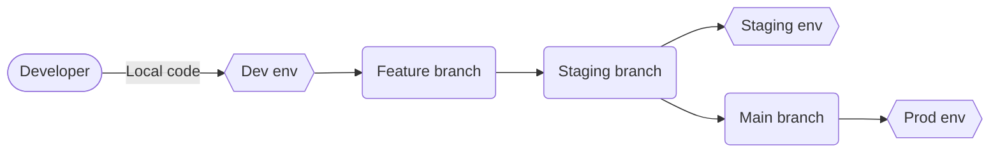
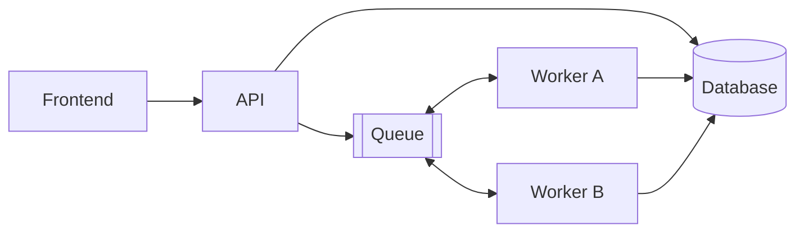

## Environnements

```mermaid
flowchart LR
    User([Developer])
    Dev{{Dev env}}
    Staging{{Staging env}}
    Prod{{Prod env}}

    F(Feature branch)
    M(Main branch)
    S(Staging branch)

    User -- Local code --> Dev
    Dev --> F
    F --> S
    S --> Staging
    S --> M
    M --> Prod
```

## Architecture

```mermaid
flowchart LR
    db[(Database)]
    queue[[Queue]]
    api[API]
    frontend[Frontend]
    workerA[Worker A]
    workerB[Worker B]

    frontend --> api
    api --> db
    api --> queue
    queue <--> workerA
    workerA --> db
    queue <--> workerB
    workerB --> db

```