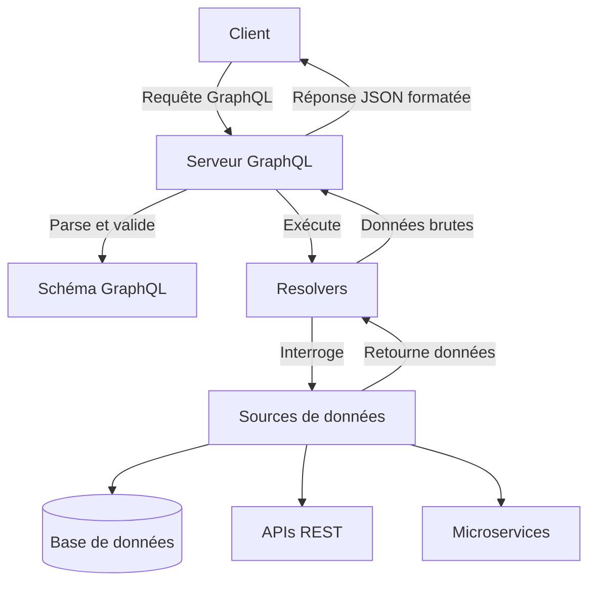

# Qu'est-ce que GraphQL ?

GraphQL est un langage de requête pour API et un environnement d'exécution créé par Facebook en 2012, rendu open-source en 2015. Contrairement à REST, GraphQL permet aux clients de demander exactement les données dont ils ont besoin.

Toutes les requêtes passent par une seule URL, contrairement aux multiples endpoints REST.

**Cas d'usage adaptés :**

- Applications mobiles avec contraintes de bande passante
- Interfaces complexes nécessitant des données variées
- APIs publiques servant divers clients aux besoins différents
- Agrégation de données provenant de multiples sources

### Principes fondamentaux

**Langage de requête déclaratif**  
Le client spécifie la structure exacte des données qu'il souhaite recevoir.

```graphql
{
  user(id: "123") {
    name
    email
    posts {
      title
      comments {
        content
      }
    }
  }
}
```

**Schéma fortement typé**  
Tout est défini par un système de types qui sert de contrat entre client et serveur.

```graphql
type User {
  id: ID!
  name: String!
  email: String
  posts: [Post!]
}

type Post {
  id: ID!
  title: String!
  content: String!
  comments: [Comment!]
}
```

### Architecture GraphQL

L'architecture GraphQL repose sur trois concepts clés :

1. **Schéma** : Définit les types de données et les opérations possibles
2. **Resolvers** : Fonctions qui déterminent comment obtenir les données pour chaque champ
3. **Moteur d'exécution** : Analyse les requêtes et orchestre l'exécution des resolvers



Le flux de traitement d'une requête GraphQL :

1. Le client envoie une requête au serveur
2. Le serveur valide la requête contre le schéma
3. Pour chaque champ demandé, le resolver correspondant est appelé
4. Les données sont assemblées selon la structure demandée
5. Le serveur renvoie une réponse JSON correspondant exactement à la requête

Cette architecture offre flexibilité et efficacité tout en maintenant une séparation claire des responsabilités.
