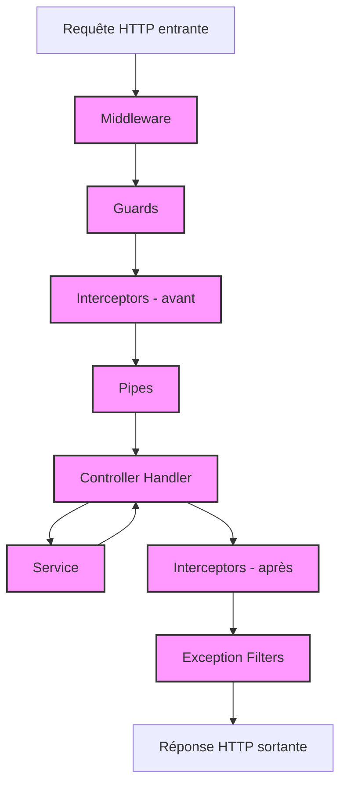

# Découpage de l’application

Chaque bout d'une application NestJS sera découpé selon une structure stricte.

Cela permettra de répartir les taches, d’avoir un code bien organisé, qui au final permettra d’avoir une très bonne qualité de code, d’améliorer le travail d’équipe et une forte scalabilité.

## Modules

https://docs.nestjs.com/modules

Toutes les logiques "business" de l’application seront séparés en modules, qui délimiteront les differentes parties de l’application, tel que l’authentification, la gestion des utilisateur, la gestion des produits etc …

Ces modules contiendront chacun des elements que nous allons voir par la suite, et l'application principale sera elle meme un module.


### Declaration des modules

```ts
// cat.module.ts
@Module({
  controllers: [CatController],
  providers: [CatService],
  imports: [
    TypeOrmModule.forFeature([CatEntity, BreedEntity]),
    BreedModule,
  ],
  exports: [CatService],
})
```

## Controllers

https://docs.nestjs.com/controllers

Ils sont la porte d’entrée du serveur depuis le client: C’est eux qui détermineront les URL, le type des paramètres attendus en entrée et les types de réponses possibles.

Attention: il ne sont là que pour recevoir et verifier les données entrantes, les déléguer aux services compétents et à répondre. Il ne doivent pas contenir de logique métier.


```ts
// cat.controller.ts
@Controller("cat") // route '/cat'
export class CatController {
  constructor(private catService: CatService) {}

  @Get("/find-all") // route '/cat/find-all'
  findAll(): Promise<CatResponseDto[]> {
    return this.catService.findAll();
  }
}
```

## Providers

https://docs.nestjs.com/providers

En Nest, tout les composants de l’app seront des classes, et celles-ci dépendront souvent d’autres classes. NestJS possède un système d’injection de dépendance, ce qui permet d’avoir facilement accès à n’importe quelle classe depuis n’importe quelle autre, de manière simple et sans se soucier de l'instanciation de ceux-ci.

Ces classes injectables sont appelée Providers et sont décorées avec `@Injectable()`.

Lorsque l'on aura besoin d'un composant, il suffira de le déclarer dans le module, et de l'injecter dans la classe qui en aura besoin.

### Services

Les services sont des Providers et seront les composants qui contiendront la logique metier: lecture/écriture dans la base de données, calculs, … et seront principalement utilisés dans les controlleurs (qui eux même éviteront de manipuler eux meme les données)

```ts
@Injectable()
export class CatService {
  constructor(
    @InjectRepository(CatEntity)
    private readonly catRepository: Repository<CatEntity>
  ) {}

  async findAll(): Promise<CatEntity[]> {
    return this.catRepository.find();
  }
}
```

## Middleware

https://docs.nestjs.com/middleware

Ils s’occupent d’effectuer des modifications sur les objets de requête et de réponse, par exemple décoder un token JWT et rajouter l’utilisateur au contexte, ou bien stopper une requête.

Les middleware peuvent s’enchainer et peuvent appeler le suivant avec `next()` avant de finir son travail.

Ils sont affectés à une liste de routes dès l'initialisation de l'application, mais sans comportement specifique à chacune d'elles.

## Guards

https://docs.nestjs.com/guards

Les guard permettent d’autoriser ou non une requête de passer. Elle passe après les middleware et avant les intercepteurs.

Les guards sont applicables par Module/Controlleur/Endpoint, contrairement aux middlewares. On peut les utiliser pour autoriser seulement les utilisateurs avec un certain role sur certaines routes par exemple.

## Intercepteurs

https://docs.nestjs.com/interceptors

Les intercepteurs permettent de modifier la donnée reçue/retournée ou interrompre la chaine.

En entrées, ils peuvent servir à utiliser du cache (pour ne pas avoir besoin d’appeler le contrôleur), savoir combien de temps une requête a mis à s’executer,...

En sortie, ils peuvent transformer une exception, filter les données retournées pour ne pas renvoyer des données sensibles, etc…

## Pipes

https://docs.nestjs.com/pipes

Modifient les données reçues par les controlleurs..

Ils permettront par exemple de valider et deserialiser les données en entrée.

## Pipeline d’execution


