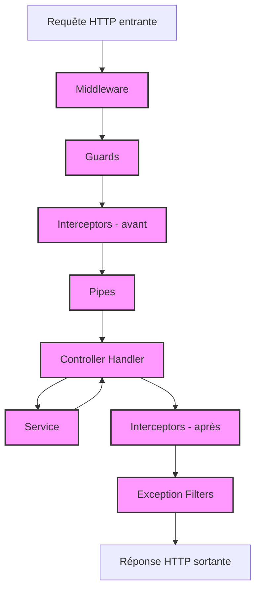

# Découpage de l'application

NestJS impose une structure modulaire précise pour organiser chaque composant de l'application.

Cette architecture stricte favorise une organisation claire du code, améliore la collaboration en équipe, garantit une meilleure qualité de développement et assure une forte évolutivité du projet.

```
src/
  |__user/
  |      |__user.entity.ts
  |      |__user.service.ts
  |      |__user.controller.ts
  |      |__user.module.ts
  |__app.module.ts
  |__main.ts
```

## Modules

https://docs.nestjs.com/modules

La logique métier de l'application est divisée en modules distincts, chacun représentant une fonctionnalité spécifique comme l'authentification, la gestion des utilisateurs ou la gestion des produits.

Ces modules encapsulent tous les composants nécessaires à leur fonctionnement, et l'application principale est elle-même un module racine qui orchestre l'ensemble.


### Déclaration des modules

```ts
// cat.module.ts
@Module({
  controllers: [CatController],
  providers: [CatService],
  imports: [
    TypeOrmModule.forFeature([CatEntity, BreedEntity]),
    BreedModule,
  ],
  exports: [CatService],
})
```

## Contrôleurs

https://docs.nestjs.com/controllers

Les contrôleurs constituent le point d'entrée de l'application depuis l'extérieur. Ils définissent les routes (URLs), spécifient les paramètres attendus en entrée et structurent les types de réponses.

Leur rôle se limite à recevoir les données entrantes, les transmettre aux services appropriés et renvoyer une réponse formatée. Ils ne doivent pas contenir de logique métier complexe.


```ts
// cat.controller.ts
@Controller("cat") // route '/cat'
export class CatController {
  constructor(private catService: CatService) {}

  @Get("/find-all") // route '/cat/find-all'
  findAll(): Promise<CatResponseDto[]> {
    return this.catService.findAll();
  }
}
```

## Providers

https://docs.nestjs.com/providers

Dans NestJS, tous les composants sont des classes qui dépendent souvent d'autres classes. Le framework intègre un système d'injection de dépendances sophistiqué, permettant d'accéder facilement à n'importe quelle classe depuis une autre, sans se préoccuper de leur instanciation.

Ces classes injectables, appelées Providers, sont annotées avec le décorateur `@Injectable()`.

Pour utiliser un Provider, il suffit de le déclarer dans le module approprié et de l'injecter dans le constructeur de la classe qui en a besoin.

### Services

Les services sont des Providers spécialisés qui implémentent la logique métier de l'application : interactions avec la base de données, calculs, traitements complexes, etc. Ils sont principalement utilisés par les contrôleurs, qui délèguent ainsi le traitement des données.

```ts
@Injectable()
export class CatService {
  constructor(
    @InjectRepository(CatEntity)
    private readonly catRepository: Repository<CatEntity>
  ) {}

  async findAll(): Promise<CatEntity[]> {
    return this.catRepository.find();
  }
}
```

## Middleware

https://docs.nestjs.com/middleware

Les middlewares manipulent les objets de requête et de réponse, par exemple en extrayant et décodant un token JWT pour identifier l'utilisateur, ou en interrompant une requête non autorisée.

Les middlewares peuvent être chaînés et transférer le contrôle au middleware suivant via l'appel à `next()`, avant ou après avoir effectué leur traitement.

Ils sont appliqués globalement à un ensemble de routes dès l'initialisation de l'application, sans distinction de comportement spécifique à chaque route.

## Guards

https://docs.nestjs.com/guards

Les guards déterminent si une requête doit être traitée ou rejetée. Ils interviennent après les middlewares et avant les intercepteurs.

Contrairement aux middlewares, les guards peuvent être appliqués de manière ciblée à un module, un contrôleur ou une route spécifique. Ils sont particulièrement utiles pour implémenter des contrôles d'accès basés sur les rôles utilisateurs.

## Intercepteurs

https://docs.nestjs.com/interceptors

Les intercepteurs permettent de modifier les données reçues ou renvoyées, ainsi que d'interrompre la chaîne de traitement si nécessaire.

En entrée, ils peuvent implémenter des mécanismes de cache (évitant ainsi l'appel au contrôleur), mesurer le temps d'exécution d'une requête, ou effectuer d'autres traitements préalables.

En sortie, ils peuvent transformer le format d'une exception, filtrer les données sensibles avant leur envoi, ou adapter la réponse selon d'autres critères.

## Pipes

https://docs.nestjs.com/pipes

Les pipes transforment les données reçues par les contrôleurs.

Ils sont principalement utilisés pour valider et convertir (désérialiser) les données entrantes dans le format attendu par l'application.

## Pipeline d'exécution


