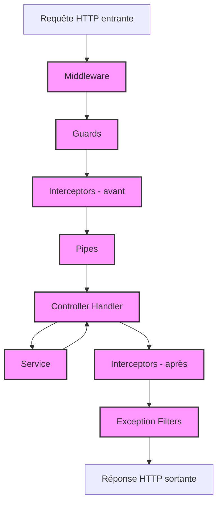

NestJS est un framework pour NodeJS permettant de créer des backend complets et scalable.

Sa particularité est d’avoir une architecture stricte et d’utiliser les decorateurs pour définir les comportement de l’application afin de réduire au maximum le “boilerplate code”, ce qui assez rare en Javascript.

::: info 💡

La documentation officielle est bien évidemment la référence, cette page n’a pour but que d’énumerer les concepts fondamentaux du framework.

[https://docs.nestjs.com/](https://docs.nestjs.com/)

:::

# Fondamentaux

## Découpage de l’application

Chaque bout de l’application sera découpé selon une structure stricte.

Cela permettra de répartir les taches, d’avoir un code bien organisé, qui au final permettra d’avoir une très bonne qualité de code, d’améliorer le travail d’équipe et une forte scalabilité.

### Modules

Tout les elements de l’application seront regroupés en module, qui délimiteront les differentes parties de l’application, tel que l’authentification, la gestion des utilisateur, la gestion des produits etc …

### Controllers

Ils sont la porte d’entrée du serveur depuis le client: C’est eux qui détermineront les URL, le type des paramètres attendus en entrée et les types de réponses possibles.

Attention: il ne sont là que pour recevoir et verifier les données entrantes, les déléguer aux services compétents et à répondre. Il ne doivent pas contenir de logique métier.

### Providers/Services

En Nest, tout les composants de l’app seront des classes, et celles-ci dépendront souvent d’autres classes. NestJS possède un système d’injection de dépendance, ce qui permet d’avoir facilement accès à n’importe quelle classe depuis n’importe quelle autre.

Ces classes injectables sont appelée Providers, et représentent souvent des Services

Les services seront ceux qui contiendront la logique metier: lecture/écriture dans la base de données, calculs, …

### Middleware

Ils s’occupent d’effectuer des modifications sur les objets de requête et de réponse, par exemple décoder un token JWT et rajouter l’utilisateur au contexte, ou bien stopper une requête.

Les middleware peuvent s’enchainer et peuvent appeler le suivant avec `next()` avant de finir son travail.

Ce sont les premiers a traiter la requete.

### Guards

Les guard permettent d’autoriser ou non une requête de passer. Elle passe après les middleware et avant les intercepteurs.

Les guards sont personnalisable par Module/Controlleur/Endpoint, contrairement aux middleware. On peut les utiliser pour autoriser seulement les utilisateurs avec un certain role sur certaines routes par exemple.

### Intercepteurs

Les intercepteurs permettent de modifier la donnée reçue/retournée ou interrompre la chaine.

Ils peuvent servir à utiliser du cache (pour ne pas avoir besoin d’appeler le contrôleur), savoir combien de temps une requête a mis à s’executer, transformer une exception, s’assurer que des données sensibles ne soient pas renvoyées, etc…

Ils passent avant et après les contrôleurs

### Pipes

Permet de valider/transformer les données en entrées. Appelé juste avant le contrôleur.

Il est conseillé d’utiliser des DTO avec validation, comme on verra par la suite

### Pipeline d’execution



## Specificités

### Decorateurs

Beaucoup des fonctionnalités de l’application seront définies par des décorateurs

```tsx
@Module({
  controllers: [CatsController],
  providers: [CatsService],
})
@Controller("cats")
export class CatsController {
  constructor(private catsService: CatsService) {}

  @Get("/")
  findAll(): CatsResponseDto {
    return this.catsService.findAll();
  }
}
```

### DTO

Les DTOs serviront de definition de types pour toutes les données que recevra et retournera l’API.

Ils se distinguent des modèles de base de données pour définir uniquement les types de données échangés par le service.

[class-transformer](https://github.com/typestack/class-transformer): Utilisé pour définir des structures afin de les serialiser/deserialier, c’est à dire les transformer entre un objet et une classe.

[class-validator](https://github.com/typestack/class-validator): Permet de définir le type des proprietés d’une classe, définir les valeurs qu’elles peuvent prendre et les valider.

### Exceptions

A tout moment dans l’application, on peut stopper une requete et retourner une erreur en lancant une exception.

```tsx
throw new HttpException("Forbidden", HttpStatus.FORBIDDEN);
throw new ForbiddenException();
```

## CLI

Nest fourni un outil en ligne de commande très pratique pour developper une application

```bash
# installer la cli
npm i -g @nestjs/cli
# Creer un nouveau projet
nest new my-project
# Generer des composants
nest g module cats
nest g controller cats
nest g service cats
```
