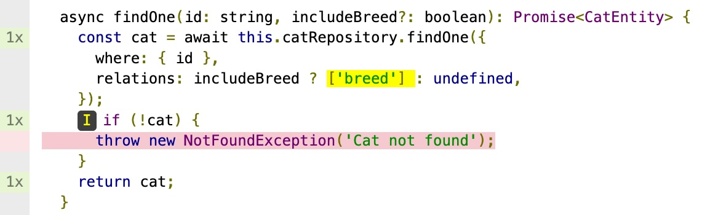

# Tests

- https://docs.nestjs.com/testing
- https://jestjs.io/

Tester de manière exhaustive les applications backend est crucial, car elles sont responsables de la gestion et de la sécurisation des données, contrairement aux applications frontend qui se concentrent principalement sur l'interface utilisateur.

Si les tests manuels sont souvent privilégiés pour les applications frontend (où l'expérience visuelle est prépondérante), cette approche devient rapidement inefficace pour les backends. Les tests programmatiques sont donc indispensables pour garantir la fiabilité des applications backend, et sont généralement plus simples à mettre en œuvre que pour le frontend. L'intelligence artificielle peut d'ailleurs considérablement accélérer l'écriture de ces tests.

NestJS intègre un système de tests robuste et intuitif qui facilite grandement cette tâche essentielle.

## Tests unitaires

Les tests unitaires se concentrent sur des portions isolées du code.

Ils vérifient le bon fonctionnement de composants spécifiques de l'application, en prenant en compte différents scénarios d'utilisation, notamment les diverses combinaisons d'arguments que les fonctions peuvent recevoir et les différents contextes d'exécution possibles.

```ts
// cat.service.spec.ts
describe("CatService", () => {
  let service: CatService;

  beforeEach(async () => {
    const module: TestingModule = await Test.createTestingModule({
      providers: [CatService],
    }).compile();

    service = module.get<CatService>(CatService);
  });

  it("should be defined", () => {
    expect(service).toBeDefined();
  });

  it("should create and find all cats", async () => {
    await service.create({ name: "John", age: 10 });
    const result = await service.findAll();

    expect(result).toEqual([{ name: "John", age: 10 }]);
  });
});
```

### Mocks

Lorsque nous testons des composants qui dépendent d'autres parties du code, il est souvent nécessaire de créer des mocks. Cette technique permet d'isoler précisément le code testé en remplaçant ses dépendances par des implémentations contrôlées qui simulent le comportement attendu dans le contexte du test.

```ts
// cat.controller.ts
@Controller("cat") // route '/cat'
export class CatController {
  constructor(private catService: CatService) {}

  @Get("/find-all") // route '/cat/find-all'
  findAll(): Promise<CatResponseDto[]> {
    return this.catService.findAll({ breed: true });
  }
}

// cat.controller.spec.ts
it("calls catService with correct parameters", async () => {
  jest.spyOn(catService, "findAll").mockResolvedValue([]);

  const result = await controller.findAll();

  expect(result).toEqual([]);
  expect(catService.findAll).toHaveBeenCalledWith({ breed: true });
});
```

### Coverage

Les outils de tests proposent une analyse de la couverture du code, c'est à dire le pourcentage de code qui est testé. Cela permet de rapidement découvrir les zones de code qui ne sont pas testés pour assurer que tous les scenarios possibles sont pris en compte.

Pour lancer le test avec la couverture, il faut lancer la commande suivante:

```bash
npm run test:cov
```

Un dossier `coverage` sera créé contenant les rapports de couverture, avec des fichiers descriptifs pour les outils de CI et des pages html pour le developpeur.



## Tests d'intégration (End to End)

https://ladjs.github.io/superagent/

Les tests d'intégration évaluent l'application dans son ensemble, en la démarrant dans un environnement proche de la production. Ils simulent des requêtes HTTP réelles et vérifient les réponses obtenues. Ces tests examinent l'application de bout en bout, incluant tous les composants, leurs interactions et les dépendances externes comme les bases de données.

Bien que plus complexes à élaborer et plus lents à exécuter que les tests unitaires, ils sont essentiels pour valider le comportement global de l'application. Ils se concentrent généralement sur les principaux scénarios d'utilisation et les exigences critiques de sécurité plutôt que sur une couverture exhaustive de toutes les possibilités.

```ts
describe("AppController (e2e)", () => {
  let server: Server;

  beforeEach(async () => {
    const moduleFixture: TestingModule = await Test.createTestingModule({
      imports: [AppModule],
    }).compile();

    const app = moduleFixture.createNestApplication();
    await app.init();
    server = app.getHttpServer();
  });

  it("Health check should return OK", () => {
    request(server).get("/").expect(200).expect("OK");
  });

  describe("Breed API", () => {
    it("should create a new breed and retrieve it in the list", async () => {
      // Données de test pour la race de chat
      const inputBreed = {
        name: "Persian",
        description: "A fluffy breed",
      };

      // Test de création d'une race
      const createResponse = await request(server)
        .post("/breed")
        .send(inputBreed)
        .expect(201);

      const createdBreed = createResponse.body;
      expect(createdBreed.name).toBe(inputBreed.name);
      expect(createdBreed.description).toBe(inputBreed.description);
      expect(createdBreed.id).toBeDefined();
      expect(createdBreed.seed).not.toBeDefined(); // Vérifie que les champs privés ne sont pas exposés

      // Test de récupération de toutes les races
      const getAllResponse = await request(server).get("/breed").expect(200);

      // Vérifie que la race créée est bien présente dans la liste
      expect(getAllResponse.body).toContainEqual(createdBreed);
    });
  });
});
```
