# Le DOM

Le DOM (Document Object Model) est une interface de programmation qui représente la structure d'un document HTML sous forme d'arbre.

## Structure du DOM


## Virtual DOM vs Real DOM

| Caractéristique | Real DOM                     | Virtual DOM                |
| --------------- | ---------------------------- | -------------------------- |
| Nature          | Structure réelle du document | Copie légère en mémoire    |
| Performances    | Modifications coûteuses      | Modifications rapides      |
| Mise à jour     | Mise à jour complète         | Mise à jour différentielle |
| Utilisation     | Navigateur                   | Frameworks modernes        |

### Impact sur les performances

1. **Real DOM**
   - Chaque modification déclenche un reflow
   - Opérations synchrones et bloquantes
   - Consommation mémoire importante
2. **Virtual DOM**
   - Compare l'état précédent et nouveau
   - Met à jour uniquement les différences
   - Optimise les performances de rendu

### Exemple de manipulation du DOM

```jsx
// Manipulation directe (Real DOM)
document.getElementById("monElement").innerHTML = "Nouveau contenu";

// Écoute des événements
document.getElementById("monBouton").on("click", () => alert("clic !"));

// Avec un framework utilisant le Virtual DOM (React exemple)
setState({ contenu: "Nouveau contenu" }); // Le framework optimise la mise à jour
```

::: info À lire
[https://vuejs.org/guide/extras/rendering-mechanism](https://vuejs.org/guide/extras/rendering-mechanism)
:::

# Architecture orientée composant

## Principes de la réutilisabilité

- **Définition d'un composant**
  - Unité autonome et réutilisable
  - Encapsule HTML, CSS et logique JavaScript
  - Interface clairement définie
- **Avantages**
  - Maintenance simplifiée
  - Code DRY (Don't Repeat Yourself)
  - Tests facilités
  - Développement parallélisé


## Différents types de composants

À l'échelle du framework, tous les composants sont similaires. Cependant, pour maintenir un code de qualité, nous séparons les composants selon leur usage :

### App

Le composant d'application est l'unique composant principal qui va charger l'application. Il a le rôle de charger tous les modules nécessaires et c'est lui qui sera monté dans le DOM.

### Layout

Le(s) composant(s) de layout servent de squelette aux pages, afin que celles-ci aient un même format (header/footer/router, etc.).

### Pages/Vues

Les pages, aussi appelées vues en Vue, servent de composant principal pour chaque route de l'application, chargées par le routeur généralement depuis le layout.

### Data-fetching

Certains composants ont besoin de récupérer des données (via une API par exemple), et vont afficher ces données ou bien les redistribuer aux composants qu'ils utilisent, et peuvent potentiellement avoir des effets de bord (comme modifier des données via une API).

### Composants de présentation

Certains composants seront uniquement utiles pour créer l'interface, ne feront pas d'appels API, n'auront pas d'effets de bord et changeront uniquement en fonction des propriétés qui leur sont envoyées (exemples : Button, Input, Calendar, etc.).

## Communication entre composants

- **Props** (données descendantes)
  - Passage de données parent vers enfant
  - Immutables dans le composant enfant
- **Contexte**
  - Données communes à toute l'application

# Réactivité

Une des raisons principales pour lesquelles les frameworks ont été inventés, en plus de la composabilité, est la réactivité. Cela signifie garantir que lorsqu'une donnée change de valeur, son affichage doit être mis à jour partout où elle est utilisée.

Le but d'un framework est de garantir cette mise à jour et de faire en sorte qu'elle soit la plus rapide possible, afin de pouvoir afficher un maximum d'informations tout en restant fluide.

Chaque framework a sa façon de faire et c'est le plus compliqué à apprendre lorsque l'on passe d'un framework à un autre, même si globalement le principe reste le même : **utiliser des variables observables** (être notifié quand elles changent de valeur afin de mettre à jour l'affichage).

> Voir [Panorama des frameworks populaires](./ecosysteme#panorama-des-frameworks-populaires) pour comparer les différentes implémentations de réactivité des frameworks.

::: info 💡

Il est vivement recommandé de consulter les explications sur la reactivité dans la documentation officielle du framework que vous utilisez.

[https://vuejs.org/guide/extras/reactivity-in-depth.html](https://vuejs.org/guide/extras/reactivity-in-depth.html)

:::

# Gestion de l'État (State Management)

## Principes fondamentaux

On va toujours séparer les données d'état d'une application en deux types :

- **État local**
  - Données propres à un composant
  - Gestion simple et directe
  - Pas fait pour les données présentes à différents endroits
- **État global**
  - Données partagées entre composants
  - Passage par un store centralisé
    - Single source of truth
    - Actions et mutations contrôlées
    - État prévisible
    - Mise à jour automatique partout où la donnée est utilisée
    - Solutions dédiées (Pinia, Redux, contexte, etc.)

```mermaid
graph LR
    A[État Global] --> B[Composant A]
    A --> C[Composant B]
    A --> D[Composant C]
    B --> E[État Local A]
    C --> F[État Local B]
    D --> G[État Local C]
```



# Communication avec le Backend

## APIs REST

- **Principes**
  - Endpoints standardisés
  - Méthodes HTTP (GET, POST, PUT, DELETE)
  - Réponses formatées (JSON)

L'inconvénient d'une API REST est que le client doit systématiquement requêter le serveur pour obtenir des données à jour.

## GraphQL

GraphQL est un langage de requête et un environnement d'exécution pour les API, créé par Facebook en 2015. Contrairement aux API REST traditionnelles, GraphQL offre plusieurs avantages distinctifs :

1. **Requêtes précises** : Les clients peuvent demander exactement les données dont ils ont besoin, ni plus ni moins.
2. **Structure hiérarchique** : Les données sont organisées de manière hiérarchique, reflétant naturellement les relations entre objets.
3. **Un seul endpoint** : Contrairement à REST qui utilise plusieurs endpoints, GraphQL utilise généralement un seul point d'entrée.
4. **Typage fort** : GraphQL définit un schéma typé qui sert de contrat entre le client et le serveur.
5. **Introspection** : Les clients peuvent interroger le schéma pour découvrir les capacités de l'API.

GraphQL est particulièrement utile pour les applications modernes avec des interfaces complexes et des besoins de données variables, réduisant ainsi le surchargement de données et améliorant les performances. Il offre aussi un système de souscription qui permet d'obtenir des mises à jour de données en temps (presque) réel (pas aussi performant que WebSocket).

Un des gros avantages est que, contrairement aux API REST, qui peuvent casser les clients si le format des réponses change, le retour d'une requête GraphQL sera toujours identique.

## WebSocket

La technologie WebSocket permet une communication bidirectionnelle entre un client et un serveur. La connexion est ouverte au démarrage de l'application, et le client ou le serveur peut envoyer des informations à n'importe quel moment à l'autre partie. Cela permet d'avoir des données mises à jour en temps réel (jeux vidéo, plateforme de trading, chat).

```mermaid
sequenceDiagram
    participant F as Frontend
    participant B as Backend API
    F->>B: Requête HTTP
    B->>F: Réponse JSON
    F<<-->>B: WebSocket
    F->>F: Mise à jour État
    F->>F: Rendu UI
```


