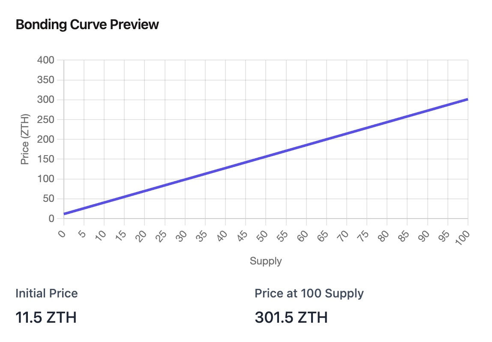

# [Projet] Plateforme de memecoin

Maintenant que vous maitrisez les concepts de base, vous allez créer la partie frontend d’une plateforme de memecoins !

## Description du projet

L’application est une plateforme de memecoins, où les utilisateurs peuvent créer et acheter/vendre des memecoins.

Les utilisateurs peuvent gagner du ZTH (la monnaie native de la plateforme) en créant des memecoins, en achetant stratégiquement des coins tendance, et en les vendant au moment optimal. Le solde ZTH d'un utilisateur sert de score sur le classement de la plateforme.

Bien que le site web et ses fonctionnalités ressembleront à un projet web3, tout se déroulera off-chain et n’utilisera aucune blockchain.

### Tokenomics

- Chaque utilisateur reçoit 100 ZTH à l’inscription.
- Créer un memecoin coûte 1 ZTH
- Le trading des memecoin se base sur un mécanisme de _bonding curve_
  - L’échange ne se fait pas entre utilisateurs mais via une reserve de liquidité en ZTH
  - Le prix est directement lié à la quantité de token existant
  - Lorsqu’un utilisateur achète (mint) un token (avec du ZTH), le prix de celui-ci augmente et les ZTH dépensés sont placés dans la reserve
  - Lorsqu’un utilisateur vend (burn) un token, son prix diminue et il reçoit des ZTH venant de la reserve
  - Le montant de ZTH dans la reserve est toujours égale au prix de vente de la totalité des tokens existant
- Toute cette logique est déjà gérée par le backend fourni

#### Formule de prix

Pour une bonding curve linéaire, le prix P d'un token est directement proportionnel à la quantité de tokens en circulation S (supply):

`P = a * S + b`

Avec a (slope) et b (starting price) des constantes.

Pour acheter X tokens, le cout C revient à :

`C = a * ((X+S)^2 - S^2) / 2 + X * b`

## Backend

Un backend déjà fonctionnel vous sera fourni.

La specification API est disponible à cette adresse:

[https://zero-to-hundred-backend.onrender.com/api/swagger](https://zero-to-hundred-backend.onrender.com/api/swagger)

## Travail demandé

Vous pourrez au choix utiliser VueJS ou Nuxt.

Le site web devra avoir un look fun et original, dans l’esprit crypto et degen

Vous pouvez vous inspirer de sites tels que [pump.fun](https://pump.fun/board) [memecoin.org](https://www.memecoin.org/) [deployyyyer](https://deployyyyer.io/)

Pour ce qui est modèle de données et interaction, votre unique reference sera la specification OpenAPI swagger du backend, que vous trouverez à cette adresse:

Vous devrez implementer le maximum de fonctionnalités possibles au vu de ce que est proposé par le backend.

### Bonus

- (bonne) Utilisation de Nuxt
- SEO, sitemap et metadata
- Bonne UX
- Utilisation stricte de Typescript

### Implementation de reference

https://zero-to-hundred-frontend.onrender.com
