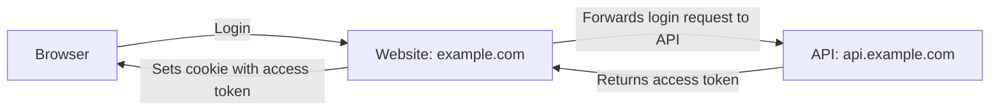
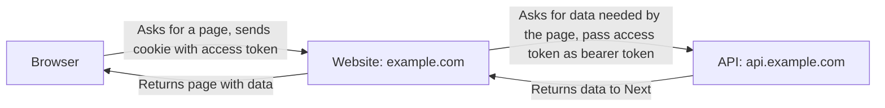

# L'authentification avec NextJS


Il est recommandé de consulter le [guide officiel](https://nextjs.org/docs/app/guides/authentication) pour l'authentification.

## Cookies

Les cookies sont un espace de stockage local au navigateur qui permet d'identifier l'utilisateur auprès du serveur. C'est le serveur qui décide des cookies à créer chez le client, le navigateur les conserve et les envoiera automatiquement à chaque requête à ce serveur. 

Les cookies sont stockés par [origine](../securite.md#origines), c'est à dire que chaque site web a ses propres cookies. 

Options des cookies:
- `SameSite`: définit les origines qui peuvent accéder au cookie
- `HttpOnly`: définit si le cookie est accessible via JavaScript
- `Secure`: définit si le cookie est envoyé uniquement sur HTTPS
- `Max-Age`: définit la durée de vie du cookie

D'autres solutions existent pour l'authentification, comme passer des tokens d'authentification dans les headers de la requête (Bearer token), qui doivent alors être stockés dans le local storage du navigateur, et qui doit être envoyé volontairement par le client. Cela implique que le code javascript de l'application soit déjà lancée pour acceder à cette donnée et envoyer les requetes avec les headers. 

Dans le contexte d'une application NextJS avec rendu côté serveur, lorsque le serveur reçoit une requête, pour une page, l'application n'a pas encore démarré côté client et il est donc impossible d'envoyer des token récuperés dans le local storage. Etant donné que le navigateur envoie automatiquement les cookies, ils sont donc une meilleure solution pour l'authentification.


```ts
// /app/api/login/route.ts
import { cookies } from 'next/headers'
 
export async function login(request: Request) {
  const expiresAt = new Date(Date.now() + 7 * 24 * 60 * 60 * 1000)
  const token = await createJWT({ userId, expiresAt })
  const cookieStore = await cookies()
 
  cookieStore.set('access_token', token, {
    httpOnly: true,
    secure: true,
    expires: expiresAt,
    sameSite: 'lax',
    path: '/',
  })
}
```

```tsx
// /app/page.tsx
import { cookies } from 'next/headers'

export default function Profile() {
    const cookieStore = await cookies()
    const token = cookieStore.get('access_token')
    if (!token) {
        redirect('/login')
    }
    const user = await getUser(token)
    return <div>{user.name}</div>
}
```

## Authentification avec une API externe
Si notre application utilise une API construite en dehors de NextJS et que l'on souhaite faire du rendu côté serveur, ce sera à NextJS d'envoyer les token d'authentification à cette API. 






## NextAuth

NextAuth est une librairie avancée de gestion de l'authentification pour NextJS.

https://next-auth.js.org/