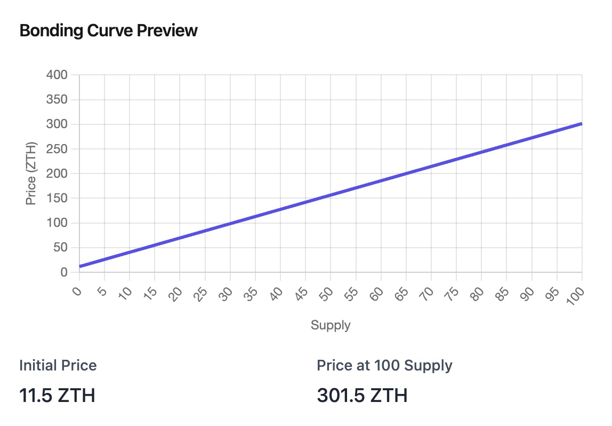

# [Projet] Plateforme de memecoin

Maintenant que vous maitrisez les concepts de base, vous allez créer une plateforme de memecoins !

## Description du projet

L’application est une plateforme de memecoins, où les utilisateurs peuvent créer et acheter/vendre des memecoins.

Les utilisateurs peuvent gagner du ZTH (la monnaie native de la plateforme) en créant des memecoins, en achetant stratégiquement des coins tendance, et en les vendant au moment optimal. Le solde ZTH d'un utilisateur sert de score sur le classement de la plateforme.

> Bien que le site web et ses fonctionnalités ressembleront à un projet web3, tout se déroulera off-chain et n’utilisera aucune blockchain.

### Plateforme d'exemple

Une application de démonstration qui fournit les fonctionnalités demandées est disponible à l'adresse suivante:
https://zero-to-hundred-frontend.onrender.com

L'objectif est de reproduire une application similaire.

## Travail demandé

L'interface utilsateur devra être soignée, réactive et avec un design élégant.

Vous pouvez vous inspirer de sites tels que [pump.fun](https://pump.fun/board) [memecoin.org](https://www.memecoin.org/) [deployyyyer](https://deployyyyer.io/)

### Contraintes techniques

- Application developpée avec NextJS v15 avec App Router
- Optimisation de l'application, utilisation au maximum des server components et server actions
- Optimisation des composants (~ utilisation de useMemo et useCallback)
- Authentification sécurisée
- Bonne gestion du SEO, sitemap et metadata
- Utilisation stricte de Typescript
- Utiliser à differents endroits au moins une fois chacune des methodes de data fetching suivantes:
  - RSC pur
  - CSR pur
  - RSC > CSR sans streaming
  - RSC > CSR streaming

## Recommandations

- Base de données: PostgreSQL avec Prisma/Drizzle
- Style: TailwindCSS avec shadcn/ui ou équivalent

## Bonus

- Tests unitaires
- Tests E2E
- Mise à jour de l'interface en temps réel (prix, transactions, ...)

### Tokenomics

- Chaque utilisateur reçoit 100 ZTH à l’inscription.
- Créer un memecoin coûte 1 ZTH
- Le trading des memecoin se base sur un mécanisme de _bonding curve_
  - L’échange ne se fait pas entre utilisateurs mais via une reserve de liquidité en ZTH
  - Le prix est directement lié à la quantité de token existant
  - Lorsqu’un utilisateur achète (mint) un token (avec du ZTH), le prix de celui-ci augmente et les ZTH dépensés sont placés dans la reserve
  - Lorsqu’un utilisateur vend (burn) un token, son prix diminue et il reçoit des ZTH venant de la reserve
  - Le montant de ZTH dans la reserve est toujours égale au prix de vente de la totalité des tokens existant
- Toute cette logique est déjà gérée par le backend fourni

> Dans un premier temps il sera accepté de fournir une logique de trading très basique afin de se concentrer sur l'interface en elle même.

  

    
  

  

    
  

#### Formule de prix

Pour une bonding curve linéaire, le prix P d'un token est directement proportionnel à la quantité de tokens en circulation S (supply):

`P = a * S + b`

Avec a (slope) et b (starting price) des constantes.

Pour calculer le prix d'achat ou de vente, il faut donc calculer l'intégrale de la fonction de prix entre la quantité de tokens en circulation actuelle et la quantité de tokens en circulation après l'achat ou la vente.

Pour acheter X tokens, le cout C revient à :

`C = a * ((X+S)^2 - S^2) / 2 + X * b`

## Projets alternatifs

Le projet proposé est une idée d'exemple, mais vous pourrez partir sur un autre sujet de votre choix si vous le souhaitez, tant que les contraintes techniques sont respectées.

Voici d'autres suggestions de projets:

- Projet perso de votre choix
- Application de gestion de playlist des plateforme de streaming (spotify, deezer, ...) et synchronisation entre les plateformes ([exemple](https://soundiiz.com/tutorial/spotify-to-youtube-music))