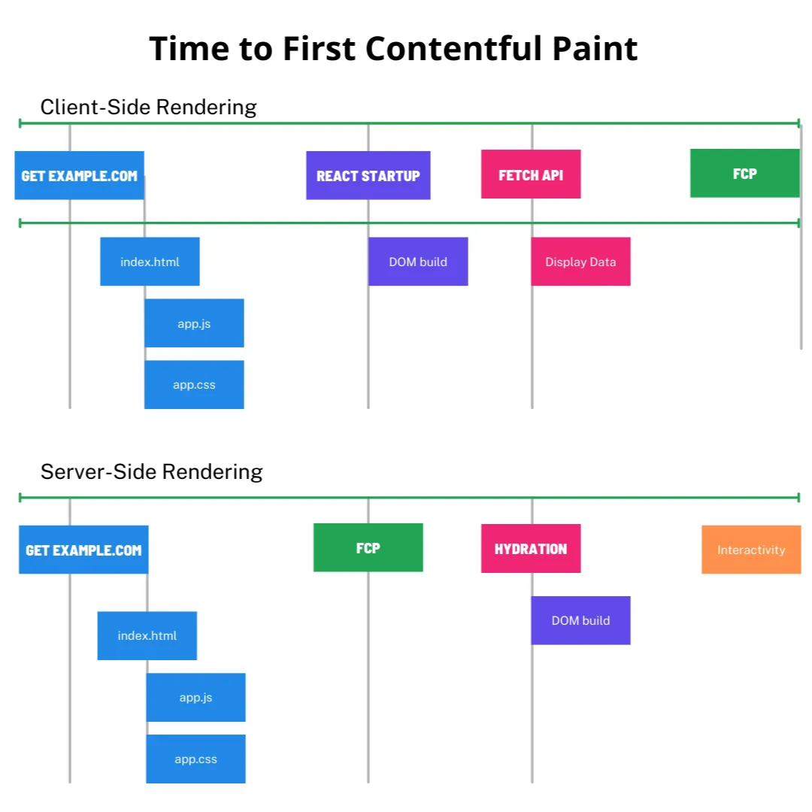

# **Les différents types de rendu d'applications frontend**

## **Client-Side Rendering (CSR)**

- **Définition** : Le rendu est effectué entièrement côté client, dans le navigateur de l'utilisateur.
- **Fonctionnement** : Le serveur envoie un fichier HTML minimal avec des liens vers des scripts JavaScript. Une fois chargés, ces scripts créent dynamiquement le contenu de la page.
- **Caractéristiques** :
  - Charge initiale plus longue
  - Navigation ultérieure très rapide
  - Interactivité élevée
  - Peut poser des problèmes de SEO si mal implémenté
  - Consommation de ressources côté client

```tsx
<!DOCTYPE html>
<html lang="">
  <head>
    <meta charset="UTF-8">
    <link rel="icon" href="/favicon.ico">
    <meta name="viewport" content="width=device-width, initial-scale=1.0">
    <title>Zero to Hundred</title>
  </head>
  <body>
    <div id="app"></div>
    <script type="module" src="/src/main.ts"></script>
  </body>
</html>
```

## **Server-Side Rendering (SSR)**

- **Définition** : Le rendu HTML est effectué sur le serveur avant d'être envoyé au client.
- **Fonctionnement** : Le serveur exécute le code JavaScript, génère le HTML complet et l'envoie au client, qui peut ensuite l'"hydrater" pour le rendre interactif.
- **Caractéristiques** :
  - Premier chargement rapide
  - Meilleur pour le SEO
  - Moins de ressources utilisées côté client
  - Requiert plus de ressources serveur
  - Frameworks comme Next.js (React), Nuxt.js (Vue), SvelteKit facilitent cette approche

> React a récemment introduit le concept de server component, que Next utilise maintenant nativement

```html
<!DOCTYPE html>
<html lang="">
  <head>
    <meta charset="UTF-8" />
    <link rel="icon" href="/favicon.ico" />
    <meta name="viewport" content="width=device-width, initial-scale=1.0" />
    <title>Zero to Hundred</title>
  </head>
  <body>
    <div id="app">
      <h1>Articles</h1>
      <div>
        <h2>Article 1</h2>
        <h2>Article 2</h2>
        <h2>Article 3</h2>
      </div>
    </div>
    <script type="module" src="/src/main.ts"></script>
  </body>
</html>
```

<aside>
💡

**Hydration**

L'hydration fait référence au processus par lequel une application JavaScript "reprend vie" dans le navigateur après qu'un HTML initial a été généré et envoyé par le serveur. Plus précisément, c'est le processus qui permet de transformer une page HTML statique (rendue côté serveur) en une application interactive côté client, comme si elle était CSR.

</aside>



## **Static Site Generation (SSG)**

- **Définition** : Les pages HTML sont pré-générées lors de la phase de build.
- **Fonctionnement** : Toutes les pages sont créées en amont et servis comme des fichiers statiques.
- **Caractéristiques** :
  - Performances optimales
  - Sécurité maximale
  - Excellent pour le SEO
  - Idéal pour les contenus qui ne changent pas fréquemment
  - Outils comme Astro, Gatsby, VuePress, Nuxt Content

## **Incremental Static Regeneration (ISR)**

- **Définition** : Une évolution du SSG qui permet de régénérer des pages spécifiques à intervalles réguliers ou sur demande.
- **Caractéristiques** :
  - Combine les avantages du SSG avec une certaine fraîcheur des données
  - Disponible dans des frameworks comme Next.js

## Hybride

Il est possible de combiner toutes ces techniques: On peut pré-rendre le contenu au build (articles de blog) tout en gardant un site dynamique qui récupère certaines données (commentaires) à l’execution (**_islands architecture_**)

## Problèmes rencontrés en SSR

- **Différences entre environnements** : Le code doit s'exécuter à la fois côté serveur (Node.js) et côté client (navigateur), avec des API différentes
- **Répartition de l’état** : L’application tourne sur deux machines en meme temps (client et serveur), certaines données sont accessible d’un coté et pas de l’autre, synchronisation des deux
- **Accès aux API navigateur** : Les API spécifiques au navigateur (`window`, `document`, `localStorage`, `web3`) ne sont pas disponibles côté serveur
- **Gestion des imports conditionnels** : Nécessité de charger différents modules selon l'environnement d'exécution
- **Charge serveur accrue** : Génération de HTML pour chaque requête, augmentant la charge CPU et mémoire
- **Techniques en constante evolution**: Les façons de developper un site en SSR évoluent très vite et il est facile d’être perdu dans les mises à jour des framework
