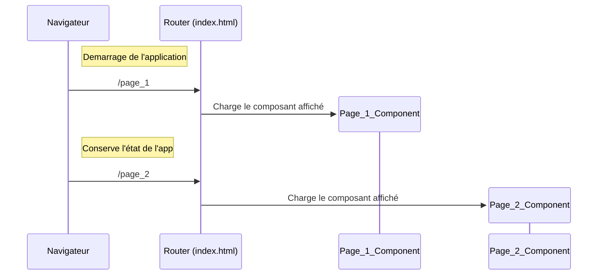
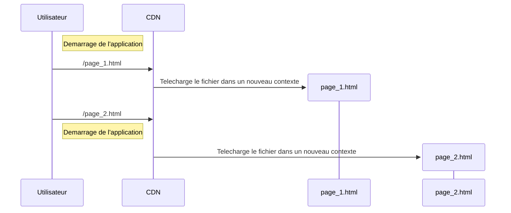

# Routage côté client

## Single Page Application (SPA)

- **Définition**
  - Application web monopage
  - Navigation sans rechargement
  - Expérience fluide type "application native"
- **Fonctionnement**
  - Chargement initial de l'application
  - Mise à jour dynamique du contenu
  - Gestion de l'historique du navigateur

## Contre exemple

## SSG

Les application à rendu statique n'auront generalement pas besoin de routeur (comme ce site)
