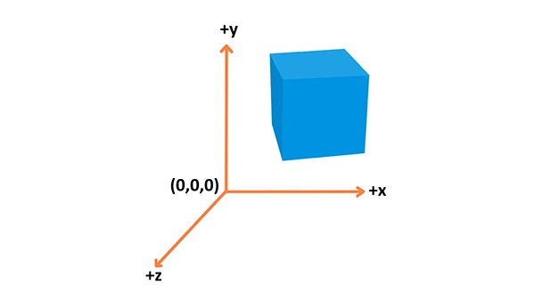
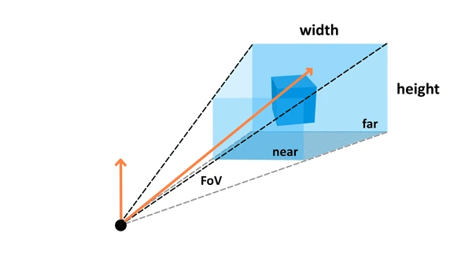
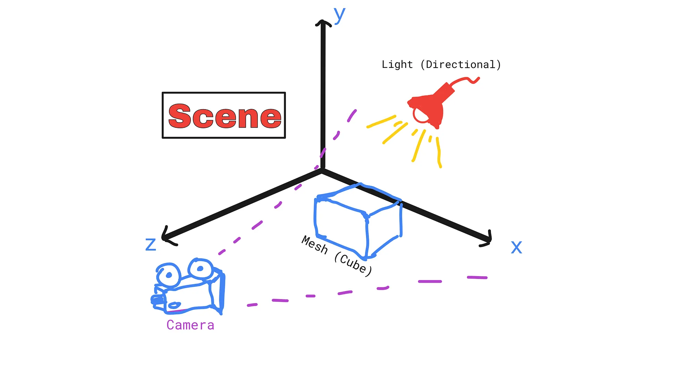

# Concepts

Voici les terme clés utilisés par ThreeJS. Chacun de ces termes sont reliés à des classes Javascript dans la librairie, souvent un implémenté sous differentes formes

## Vector

[https://threejs.org/docs/index.html?q=vector#api/en/math/Vector3](https://threejs.org/docs/index.html?q=vector#api/en/math/Vector3)

Un **Vector** est un ensemble de valeurs du même type, pour la plupart du temps des coordonnées, et sur lequel on pourra effectuer des calculs récurrents (addition, multiplication, norme, …). Possède les attributs `x, y, z`



```jsx
const vector = new THREE.Vector3(1, 1, 1); // Vecteur
vector.x = 2;
vector.y = 3;
vector.z = 4;
```

## Geometry

[https://threejs.org/docs/index.html#api/en/geometries/BoxGeometry](https://threejs.org/docs/index.html#api/en/geometries/BoxGeometry)

Une **Geometry** représente la forme que prendra un objet 3D. Cela pourra être un cube, une sphere ou une forme plus complexe. Elle est constituée d’un ensemble de points reliés entre eux, qui forment des polygone, qui eux même forment des surfaces.

```c
const geometry = new THREE.BoxGeometry(1, 1, 1); // Cube
const geometry = new THREE.SphereGeometry( 15, 32, 16 ); // Sphere
```

## Material

[https://threejs.org/docs/index.html?q=mater#api/en/materials/MeshBasicMaterial](https://threejs.org/docs/index.html?q=mater#api/en/materials/MeshBasicMaterial)

Un **Material** sert a décrire comment apparait une surface: sa couleur, sa texture et surtout comment elle reagira a la lumière.

```c
const material = new THREE.MeshStandardMaterial({ color: 0x00ff00 });
```

## Mesh

[https://threejs.org/docs/index.html?q=mesh#api/en/objects/Mesh](https://threejs.org/docs/index.html?q=mesh#api/en/objects/Mesh)

Un **Mesh** est la combinaison d’une **Geometry** et d’un **Material**. C'est lui qu'on pourra placer dans notre scène.

```c
const mesh = new THREE.Mesh(geometry, material);
```

## Object3d

La plupart des objets de la scène héritent de la classe `Object3D`, notamment **Mesh**

[https://threejs.org/docs/index.html?q=Object#api/en/core/Object3D](https://threejs.org/docs/index.html?q=Object#api/en/core/Object3D)

Chaque object possède une multitude d’attributs et de fonctions pour les modifier, notamment:

- `position` (Vector3) : permet de déplacer l’objet
- `rotation` (Vector3) : permet de faire tourner l’objet

```jsx
mesh.position.x = 2;
mesh.rotation.y += Math.PI/2;  // Un quart de tour
```

::: info Rappel sur les angles
En threejs, les angles sont éxprimés en **Radians**. 

`360° = 2*PI radians`
::: 

### Groupes

Un Object3D peut contenir d'autres Object3D (decendants), ce qui permet de créer des groupes et sous groupes d'objets. Grâce à cela, déplacer l'objet parent fera déplacer de la même façon tous ses descendants. 


```js
const person = new THREE.Object3D();
person.add(head);   
person.add(legs);
person.position.x += 2; // déplacera la tête et les pieds.
console.log(person.children); // 2 objets
```
## Scene

[https://threejs.org/docs/index.html?q=scene#api/en/scenes/Scene](https://threejs.org/docs/index.html?q=scene#api/en/scenes/Scene)

Une scene est un ensemble d’objets que l’on va vouloir afficher à l'écran.

```c
const scene = new THREE.Scene();
scene.add(mesh); // Ajout de notre cube a la scene
```

## Light

[https://threejs.org/docs/?q=light#api/en/lights/Light](https://threejs.org/docs/?q=light#api/en/lights/Light)

La lumière est un element fondamental de la scène, car c'est elle qui éclairera l'ensemble des objets, sans elle on ne les verrait pas.

Il existe differents types de lumière:

- **Ambiante**: eclaire partout sans ombres
- **Point**: Eclaire partout autour d’elle telle une ampoule
- **Directional**: Eclaire dans une seule direction
- … etc, voir la doc 

```js
const light = new THREE.AmbientLight( 0x404040 ); // soft white light

const light = new THREE.PointLight( 0xff0000, 1, 100 );
light.position.set( 50, 50, 50 );

const directionalLight = new THREE.DirectionalLight( 0xffffff, 0.5 );
light.target = targetObject;

scene.add( light );
```

## Camera

[https://threejs.org/docs/index.html?q=came#api/en/cameras/PerspectiveCamera](https://threejs.org/docs/index.html?q=came#api/en/cameras/PerspectiveCamera)

La camera sera notre point de vue sur la scene, et determinera donc ce que l’on verra a l’écran. Elle possedera un champ de vision, et tout ce qui ne se trouvera pas dans celui ci ne sera pas affiché

```c
const camera = new THREE.PerspectiveCamera(
    75, // Field of view
    window.innerWidth / window.innerHeight, // aspect ratio
    0.1, // near distance
    1000 // far distance
  );
```



## Renderer

[https://threejs.org/docs/index.html?q=ren#api/en/renderers/WebGLRenderer](https://threejs.org/docs/index.html?q=ren#api/en/renderers/WebGLRenderer)

Le renderer est le moteur de rendu. C’est lui qui se chargera d’assimiler toutes les informations à afficher et les transformer en une image 2D à afficher à l’écran.

Le renderer threejs va creer un element HTML de type `canva` qu’il faudra ajouter au DOM

Nous devrons demander au renderer de faire un rendu a chaque fois que l’on veut une nouvelle image, et celui ci prendra en entrée notre **scene** et notre **camera**.

```c
const renderer = new THREE.WebGLRenderer();
renderer.setSize(window.innerWidth, window.innerHeight);
document.body.appendChild(renderer.domElement);

renderer.render(scene, camera);
```


:::warning Important

Pour afficher quelque chose à l'ecran, il faut au minumum un **Mesh** (composé d'une **Geometry** et d'un **Material**), une **Camera**, une **Light**, une **Scene** et un **Renderer**.
:::

### Schema d'une scene
